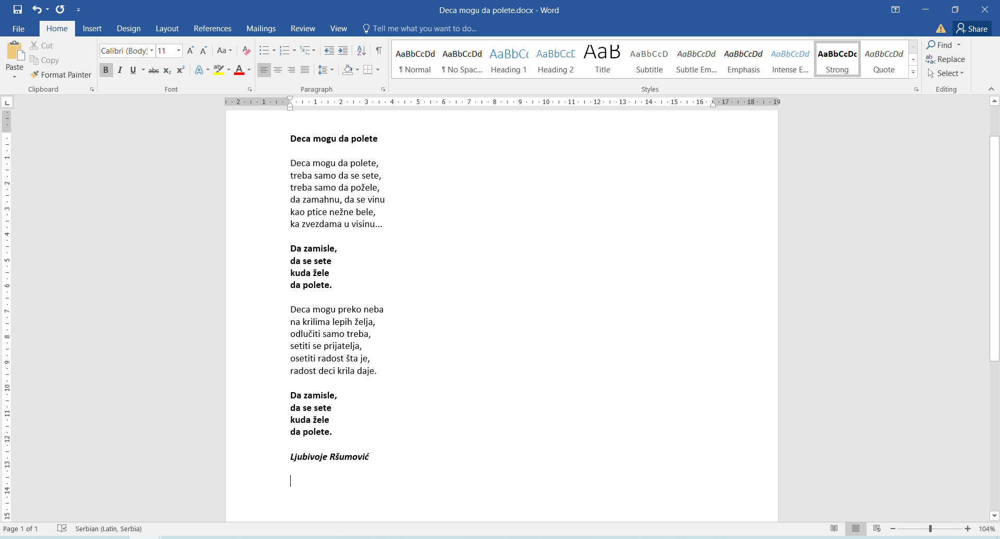

Kопирање и премештање текста - увод
===================================

Замисли ситуацију: пишеш састав у свесци. Напишеш један пасус за који ти се чини да ће бити одличан увод. 
Пишеш даље. Правиш грешке, прецртаваш. Стижеш до закључка… и баш те две реченице из увода боље би пристајале у закључку! 

Шта ћеш да урадиш? 

Једна могућност је да их прецрташ или ставиш у заграду и напишеш их у закључку (свакако ће бити видљиво да је премештен 
текст, можда и неуредно). 

Друга могућност је да их оставиш у уводу и поново напишеш у закључку (што често и није баш најбоље решење). 

На рачунару то може да се реши много боље. Без обзира на то да ли је у питању прво или друго решење, нема потребе да 
поново исписујеш/укуцаваш текст. На једноставан начин можеш да копираш и премешташ (без остављених трагова) делове 
текста. 

За почетак, уради следећу вежбу! Ова лепа песмица ће нам послужити као пример на ком ћемо ти објаснити како се то ради…

Вежба 3
-------

**Прекуцај песмицу Љубивоја Ршумовића и уреди је на следећи начин:**

- Текст укуцај користећи латиничко писмо.
- Наслов и текст који се понавља (рефрен) треба да буду подебљани.
- Име и презиме песника треба да буде написано укошеним словима.
- Сачувај документ као *Deca mogu da polete.docx* у фасциклу са претходним вежбама.

 
Пре него што наставиш са радом, постави курсор у средину било које речи и притисни на тастатури тастер **Insert**.

Како сада изгледа курсор?

Укуцај неколико слова, било којих. Шта се дешава? Слова се исписују преко претходно написаног текста.

.. suggestionnote::

 Називи прва два документа били су *Vezba1.docx* и *Vezba2.docx*. У питању је и било само вежбање како се шта ради. 
 Размисли, да ли би лако било пронаћи баш оно што тражиш ако у фасцикли имаш 25 вежби? 
 
 Када дајеш име документу, изабери неко које има везе са његовим садржајем. Немој да буде предугачко. Може бити кратко, али само ако тачно 
 знаш шта значи та ознака и који је садржај.

   