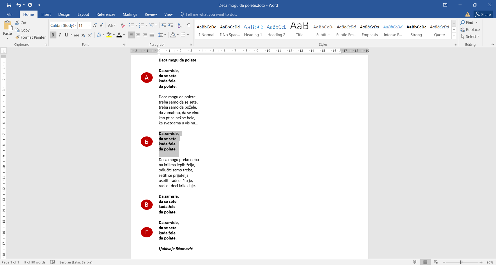
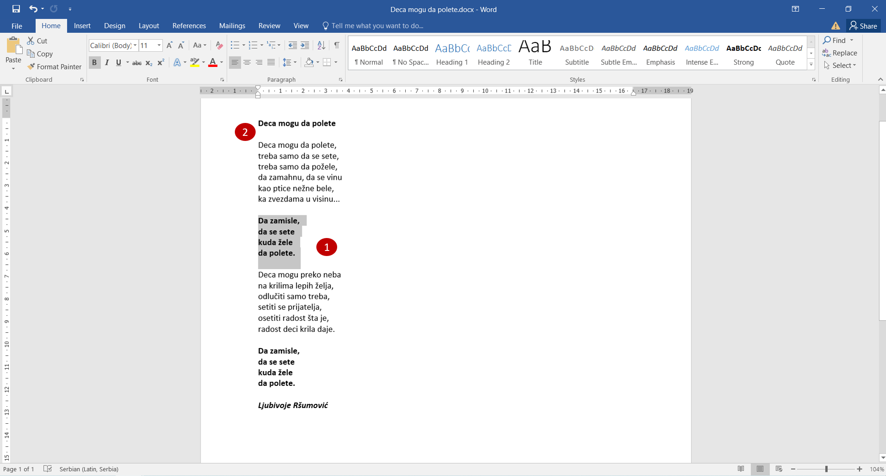
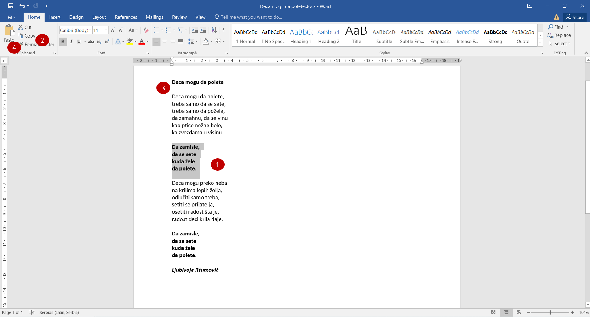

Копирање текста
===============

Да ли си током укуцавања песмице поново укуцао свако слово рефрена, и други пут?

Ако у документу постоји текст који треба да буде написан више пута, нема потребе да га више пута и укуцаваш. 
Довољно је да то урадиш једном и да га после копираш. 

Ево једног додатног задатка: треба да копираш рефрен песмице тако да се појављује четири пута: испред прве (A), 
испред друге (Б), и два пута после друге строфе (В, Г) (као на слици испод). 

   
Како ћеш ово да урадиш? (Погледај слику испод)

- Селектуј текст рефрена (1). 
- Притисни на тастатури комбинацију тастера **Ctrl + C**. 
- Постави курсор на место где желиш да копираш текст (на пример, испод наслова). (2)
- Притисни комбинацију **Ctrl + V**.

   
Додај сада, на исти начин, још један рефрен испод друге строфе (Г).

.. infonote::
  
 **Када га копираш, текст остаје и на месту на ком се налазио и појављује се на другом месту**. 
 
Ако ти није потребан тај први, можеш накнадно да га избришеш и деловаће као да је само премештен. 

.. suggestionnote::

 Постоји и други начин да ово урадиш у Ворду. Погледај слику испод и прати упутство.
 

- Селектуј текст рефрена (1).
- Кликни на дугменце *Copy* (копирај) (2).
- Постави курсор на место где желиш да копираш текст (на пример, испод наслова) (3).
- Кликни на *Paste* (преузми, налепи) (4).
