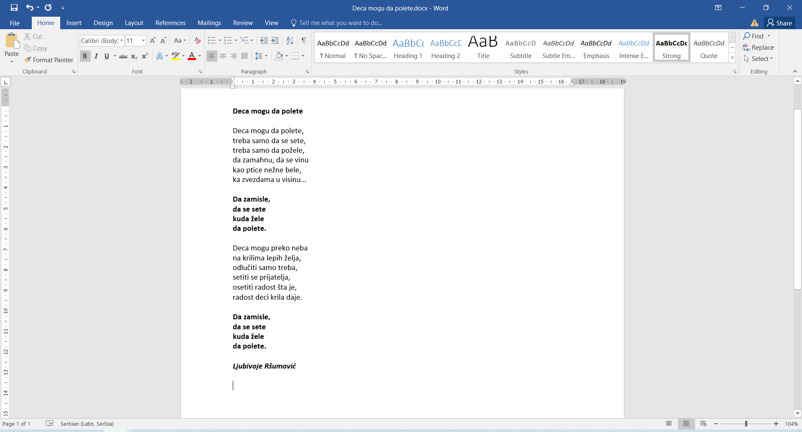

Премештање текста
=================

Из документа избриши строфе означене словима А и Б (селектуј, па **Delete**). 

Сада песмица изгледа овако: 

.. image:: ../../_images/premestanje1.png
   :width: 780
   :align: center
   
Премести рефрен означен словом Г испод прве строфе на следећи начин:

- Селектуј текст рефрена (1). 
- Притисни на тастатури комбинацију тастера **Ctrl + X**. 
- Постави курсор на место где желиш да преместиш текст (испод прве строфе). (2)
- Притисни комбинацију **Ctrl + V**.

Сада је опет све на свом месту, а нема ни вишка! 

.. infonote::
  
 **Приликом премештања, када притиснеш Ctrl + X, селектовани текст је нестао са места на ком се налазио.** 

.. suggestionnote::

 И премештање текста можеш да урадиш помоћу иконица које се налазе у главном менију Ворда.
 
Врати се неколико корака (потеза) уназад, до стања као на слици:

- Селектуј текст рефрена (1).
- Кликни на дугменце *Cut* (исеци) (2).
- Постави курсор на место где желиш да преместиш текст. (3)
- Kликни на *Paste* (преузми, налепи) (4).
   
.. learnmorenote::

 **Још мало о селектовању…**
 
 Када желиш да селектујеш **дужи текст** (који се можда налази и на две различите странице), незгодно је да превлачиш 
 мишем преко сваке речи. 
 
 Покушај следеће:
 
 Постави курсор на почетак текста који желиш да измениш. Држи притиснут тастер **Shift** и кликни на место до ког желиш да селектујеш текст. Шта се десило?
 
 Селектуј **две раздвојене речи**. Да ли си успео?
 
 Ако желиш да селектујеш раздвојене делове текста, то се ради на врло сличан начин. 
 
 Довољно је само да, приликом преласка на следећи део текста, држиш притиснут тастер **Ctrl** (контрол).
 
 Можда ће ти и ово бити корисно:
 Постави курсор између слова неке речи и направи двоклик мишем. **Цела реч** је селектована и можеш даље да вишиш 
 над њом измене које желиш.

.. infonote::

 **Подсетник:**
 
 - **Брисање текста**:  *Delete* 
 - **Зумирање документа**:  **Ctrl + скрол** (миш) 
 - **Враћање корака уназад**: *Undo* (**Ctrl + Z**)
 - **Копирање текста**: *Copy* (**Ctrl + C**)
 - **Исецање текста**: *Cut* (**Ctrl + X**)
 - **Преузимање текста**: *Paste* (**Ctrl + V**)
 - **Селектовање комплетног текста који се налази у документу**: *Select All* (**Ctrl + A**)

   