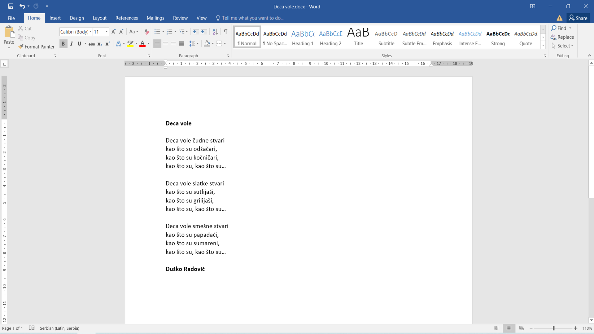
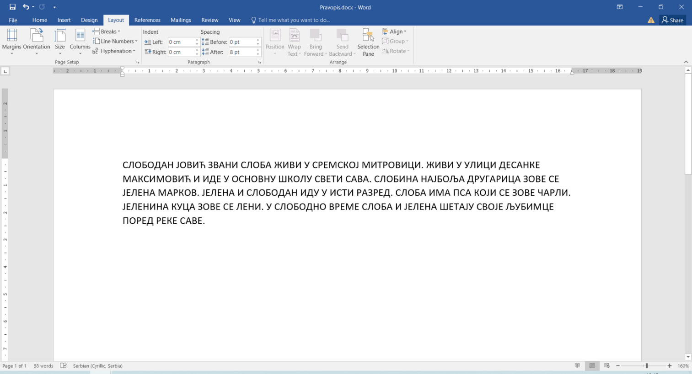

Вежбе
=====

Вежба 4
-------

.. questionnote::

 Отвори нови документ. Укуцај песмицу Душка Радовића која се налази на слици испод.
 Увежбај копирање и премештање тако што нећеш више пута укуцавати делове текста који се понављају.

Документ сачувај као *Deca vole.docx*.

Вежба 5
-------
.. questionnote::

 Отвори нови документ и прекуцај текст као на слици испод:

Направи три реда размака и унеси исти текст тако што ћеш да користиш велика и мала слова поштујући правопис. 
Документ сачувај као *Pravopis.docx*.

