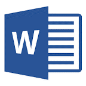
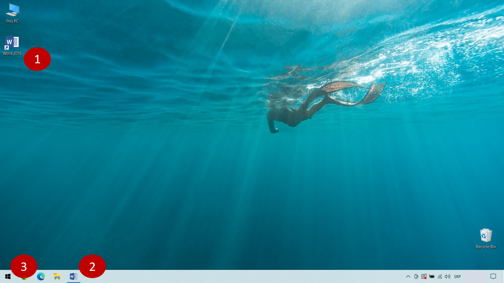
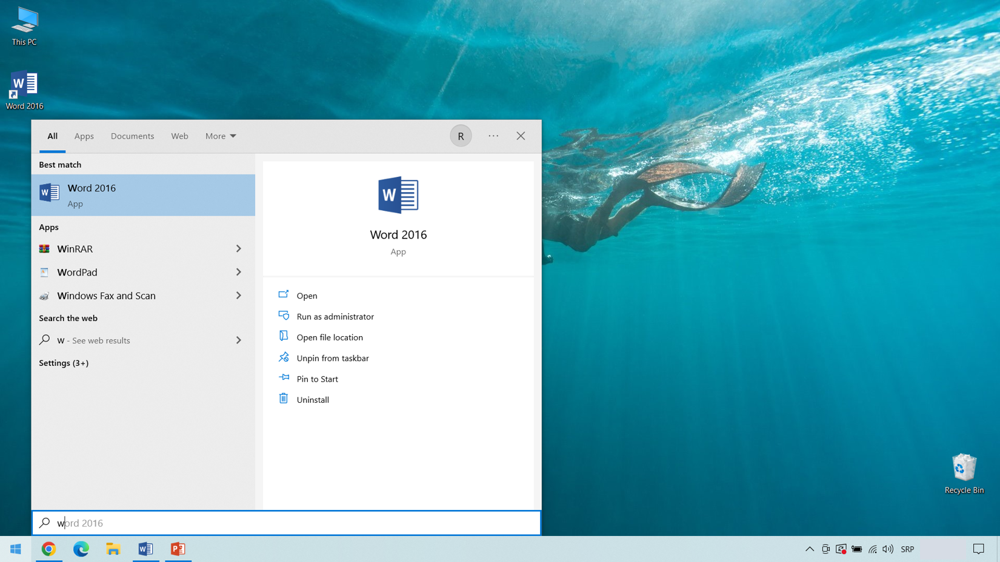
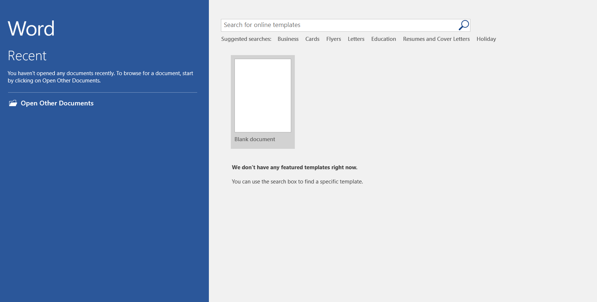
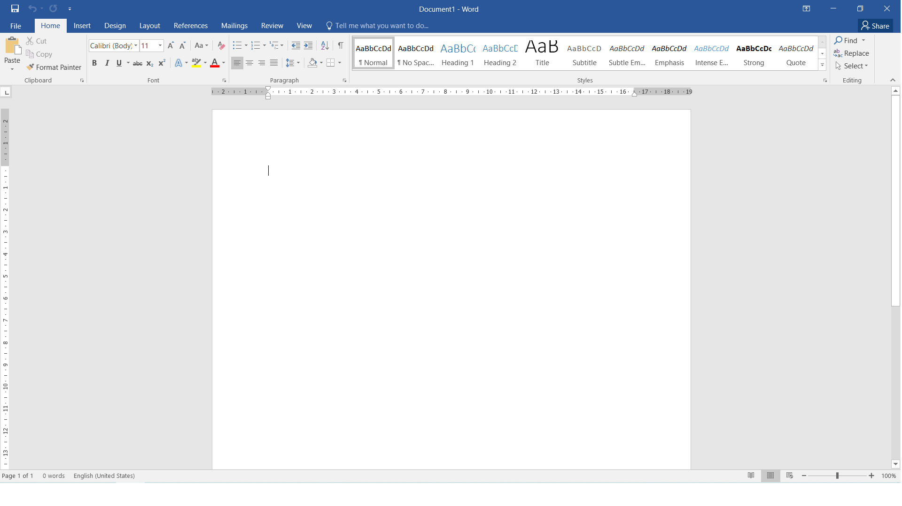
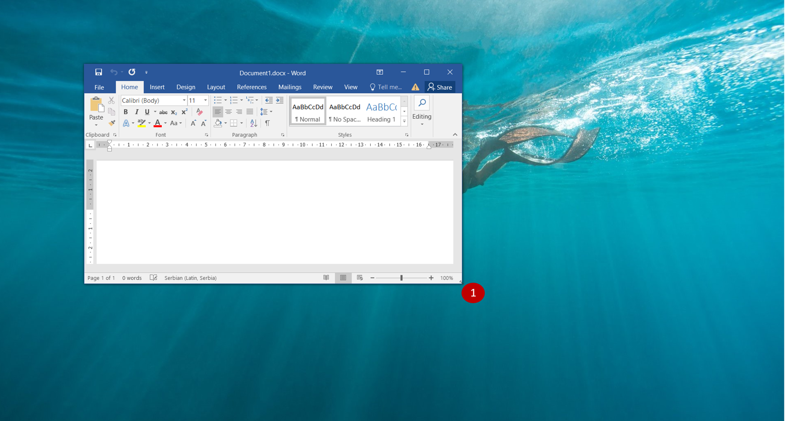

Покретање програма
==================

			
.. |win| image:: ../../_images/windows.png
            :width: 30px
			

Први записи појавили су се још пре неколико хиљада година. Било да су у питању слике, симболи или слова, писани су ручно, на различитим 
материјалима и местима и на различите начине. Када су се појавиле прве књиге руком су исписиване хиљаде страница слово по слово, ред по 
ред. Вредни писци трудили су се да њихов рукопис буде леп и читак. Писање једне књиге трајало је месецима, па и годинама. 

Одувек је постојала жеља да се направи машина која ће брже и лепше писати од човека. Током времена појавиле су се различите врсте писаћих 
машина. Снажним притискањем дирки, мастило се утискивало на папир и остављало трагове у облику различитих слова. Појавом електричних 
писаћих машина, људи више нису морали тако јако да притискају дирке. Механизам у машини покретала је струја. Дирке у тастатурама данашњих 
рачунара нису се много промениле од времена писаћих машина, али је све остало другачије.  Текст који куцамо појављује се на екрану уместо 
директно на папиру. Велика предност је што дигитални уређај може да запамти то што смо откуцали. Можемо да одштампамо документ, али  и да 
га пошаљемо некоме да чита на екрану. 

|
 
Данас, на велику срећу, можеш сам да напишеш и одштампаш текст који желиш – брзо и лако. Развијени су бројни програми 
за рачунаре који ти омогућавају да изабереш слова и знакове различитих облика, величина и боја. Да ли си чуо или можда 
већ користиш неки од њих?
 
Веома је важно  да вежбаш свој рукопис, да брзо и лепо пишеш, али је у савременом друштву поред тога потребно да научиш 
то исто да радиш и помоћу рачунара или другог дигиталног уређаја. 

Било да је у питању порука или писмо, подсетник,  састав, позивница или твој лични дневник, рачунар ти може пружити 
велику помоћ у писању – показаћемо ти како!

.. suggestionnote::

 Често у упутствима наилазиш на изразе клик, двоклик, десни клик. Шта они значе?
 
 - **клик** – притисни леви тастер миша
 - **двоклик** – два пута брзо притисни леви тастер миша
 - **десни клик** – притисни десни тастер миша
 
.. technicalnote::
 
 **На сликама у курсу најчешће се приказано оно што треба да видиш на екрану. Ако кликнеш на било коју од њих, увећаће се и моћи ћеш боље да видиш или прочиташ оно што се на њој налази.**

Један од најчешће коришћених програма за унос и обраду текста на рачунару јесте **Ворд** (енг. *Microsoft Word*, *word* - реч). 
Ворд можеш да покренеш на више начина. Најлакше  је да два пута брзо кликнеш левим тастером миша (двоклик) на иконицу |word| 
(ако се налази на радној површини) (1). 

Други начин је да кликнеш на иконицу |word| која се налази на линији задатака (енг. *Task bar*) у дну екрана (2). 
Ако се ни тамо не налази ова иконица, кликни левим тастером миша на ознаку  у доњем левом углу екрана (3). 
Појавиће се листа програма који су инсталирани на твом рачунару. Пронађи малопре поменуту иконицу за Ворд и кликни на 
натпис који се налази поред ње (на слици испод *Word 2016*, постоје и друге верзије). 

   
.. suggestionnote::

 Понекад листа програма може бити веома дугачка. Ако је то случај, за пролазак кроз листу можеш да користиш точкић (скрол) 
 на мишу или стрелице горе-доле на тастатури. Најбоље решење је да укуцаш **w** преко тастатуре, како би се Ворд брже појавио.
 
Отворио се следећи прозор:

Са леве стране се обично налази листа претходно отворених докумената (у овом случају их нема), а на десној половини 
екрана налази се умањена бела, празна страница испод које пише *Blank document*. Кликом на њу отворићеш нови, празан 
документ. Окружење у коме ћеш радити слично је окружењу на слици испод (могу се јавити мале разлике у зависности од 
верзије програма коју имаш на рачунару).

   
У горњем десном углу налазе се две сличице које служе за промену величине прозора. Прозор можеш скроз да склониш са 
екрана (минимизујеш, „спустиш га доле“) кликом на |m| или да промениш његову величину (смањујеш га или повећаваш да 
буде приказан преко целог екрана) помоћу |r|.

|

Кликни на |m|. Твој документ је и даље активан, али се сада не види. Можеш поново да га прикажеш тако што ћеш поново кликнути 
на иконицу |word| у линији задатака (сива линија дуж доње ивице екрана). Повећај га.

|

Кликни сада на |r|. Прозор се смањио. Ако приђеш доњој десној ивици прозора појавиће се стрелица (као на слици испод) (1). Кликни  и задржи притиснут 
леви тастер миша. Померањем миша можеш да мењаш димензије прозора. Покушај! Ако желиш да буде поново приказан преко целог екрана, 
кликни на исто дугменце (|r|).

