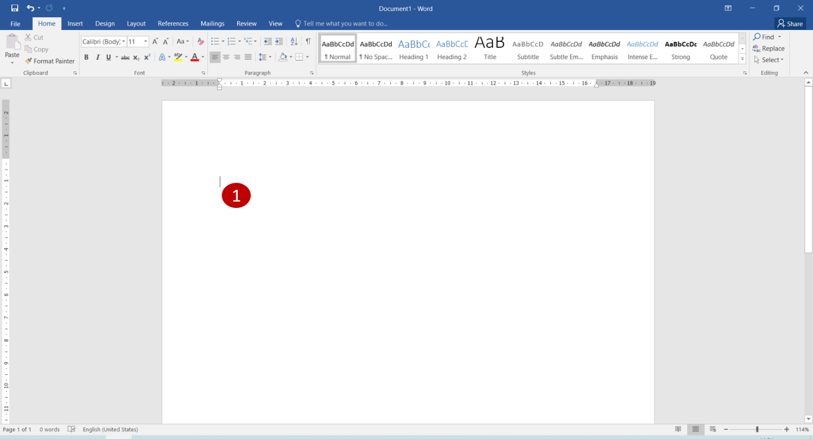
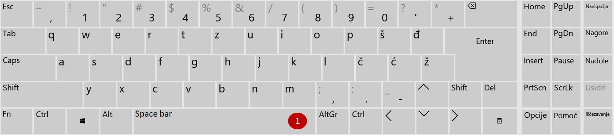
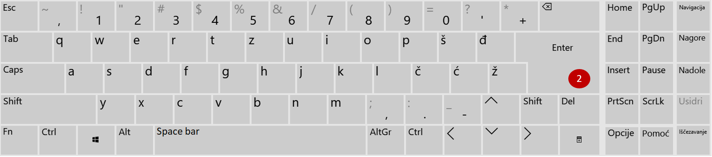

Први кораци
===========

.. |r| image:: ../../_images/resize.png
            :width: 30px
			
			
На празној страници налази се  вертикална линија која трепери, „блинка“ (1). Та мала линија се назива **курсор** и 
показује место у документу на које ће бити постављен текст који укуцаш. Позицију (место) курсора можеш да мењаш 
помоћу миша или стрелица које се налазе на тастатури (када у документу већ постоји неки текст).

   
.. questionnote::

 Кликни на било које слово на тастатури! Да ли се појавило на екрану? 
 
На овај начин уносиш слова и знаке у документ. 
Укуцај своје име, слово по слово.

Покушај сада да урадиш следеће: кликни на |r| у горњем десном углу да умањиш прозор. 

Сада кликни било где изван прозора. 
Шта се десило са курсором, да ли и даље блинка?

Притисни било које слово на тастатури. Да ли се појавило на екрану? Није! Због чега?

.. infonote::

 **На рачунару у тренутку може да буде активан само један прозор!** 

Кликом изван прозора он је постао неактиван и тада није могуће било шта мењати у документу. Може да се деси да буде 
отворено истовремено више прозора са документима у Ворду. Активан је онај у коме курсор блинка.
Укуцај сада неколико различитих речи, било којих. За размак између слова користи се тастер **Спејс** (енг. *Space*). 
Овај тастер је издужен и налази се у доњем реду (1). 

   
Вероватно си током куцања направио неку грешку, али то нам сада није важно... Укуцавај речи тако да испишеш бар три реда. 

.. questionnote::

 Шта се десило када речи више нису могле да стану у један ред? Да ли је било потребе било шта да урадиш како би прешао у следећи?

Напиши сада своје име и презиме, а у реду испод назив своје школе и место.

За прелазак у следећи ред притисни тастер **Ентер** (енг. *Enter*) (2).

 
.. suggestionnote::
 
 Дешава се да неко прелази у други ред тако што неколико пута притисне тастер Спејс. Исто тако, неко куцајући стигне 
 до краја реда и притисне Ентер како би прешао у ред испод. Овакав начин уноса текста није исправан, а можеш да 
 закључиш да и нема баш пуно смисла.
 
.. infonote::

 Када желиш да направиш размак између речи притисни тастер **Спејс**.
 
 За прелазак у нови ред притисни **Ентер**.
