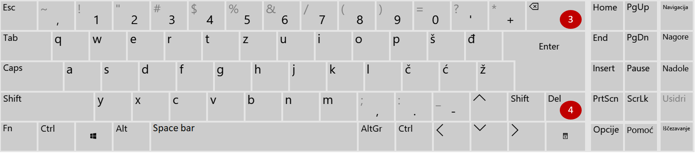
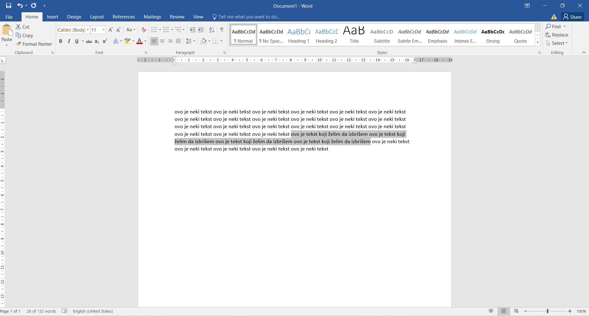

Брисање текста
==============

Када направиш грешку, лако можеш да је исправиш помоћу тастера **Бекспејс** (3) (енг. *Backspace*). 
Када притиснеш овај тастер биће обрисан први знак (слово, број, знак интерпункције или сл.) са леве стране курсора.

   
На тастатури постоји још један тастер који омогућава брисање текста. То је тастер **Дилит** (4) (енг. *Delete*).
Притисни га. Шта се десило? Обрисан је карактер који се налази са десне стране курсора.

Тастер Дилит има и важнију улогу. Када желиш да обришеш неки мало дужи текст, брисање помоћу Бекспејса ће ти одузети 
пуно времена. Ако желиш да  обришеш неки део текста, потребно је да прво кажеш програму над којим текстом желиш да 
урадиш то брисање. То ћеш урадити тако што ћеш га **селектовати** (означити). 

Постави курсор на почетак текста који желиш да избришеш. Кликни и задржи притиснут леви тастер миша. 
Полако превлачи преко жељених речи. Приметићеш да се променила боја њихове позадине. 

Сада, када је део текста који желиш да избришеш селектован, кликни Дилит. Да ли је нестао?

   
.. suggestionnote::

 Курсор можеш да премешташ с једног места на друго тако што дођеш до одговарајуће позиције и кликнеш мишем.

.. learnmorenote::

 **Тастери Home и End**
 
 На тастатури се налазе и два тастера која могу да ти олакшају пролазак кроз текст. Тастер **Home** ће пребацити курсор 
 на почетак реда, а тастер **Еnd** на крај реда у коме се тренутно налазиш (односно у ком је тренутно постављен курсор).
 

