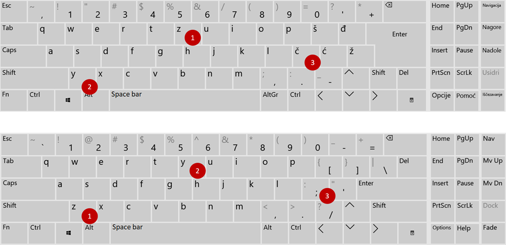
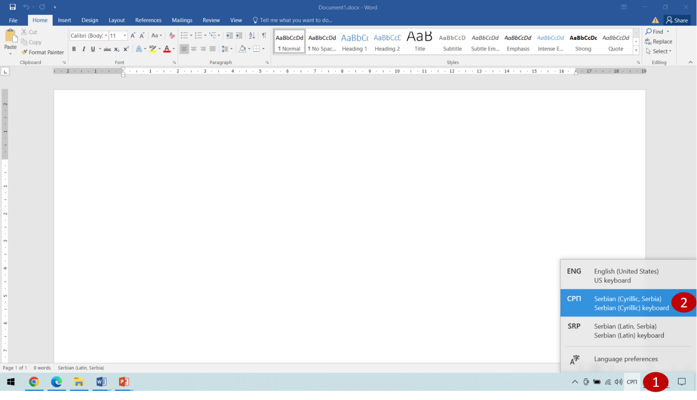
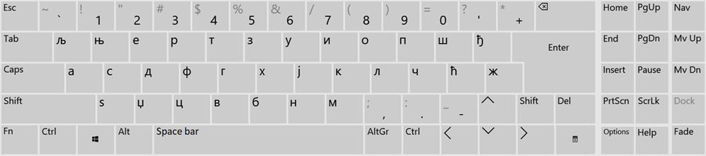

Тастатура и писмо
=================

На слици испод се налазе две врсте тастатуре. Горња има тастере са словима која се користе у нашем писму. 
На другој нема тако означених тастера, али се и помоћу ње могу унети иста слова. Коју тастатуру ти користиш?

   
Хајде да  их упоредимо!

Постоје мале разлике. Доња тастатура се често назива „**енглеска тастатура**“. Ако помоћу ње желиш да унесеш слова 
**ш**, **ђ**, **ћ**, **ж**, потребно је да притиснеш на тастере који се налазе на истом месту као на слици изнад. 
На пример, ако имаш енглеску тастатуру и желиш да укуцаш слово **ч**, притисни тастер са ознаком **;**.
Још једна разлика у распореду јавља се код слова **z** и **y**. Замењена су им места. На ово треба да обратиш пажњу и 
када бираш језик (писмо) које користиш у документу.

Различити језици користе писма са различитим симболима. Због тога је важно да, пре него што почнеш било шта да радиш, 
подесиш писмо које ћеш користити (слика испод). У доњем десном углу екрана налази се скраћена ознака језика ком је 
тренутно прилагођена тастатура (1). Кликом на ову ознаку појавиће се листа језика (писма) које можеш да користиш. 
Можеш да бираш да ли ћеш текст да уносиш ћириличким или латиничким писмом. Кликни на одговарајућу скраћеницу 
(**СРП**, **SRP**, **ENG**) (2) и укуцај било коју реч. 

   
Изабери сада српски језик, ћириличко писмо (СРП). Укуцај реч „**љубостиња**“. Где се налазе тастери за слова **љ** и **њ**?

.. questionnote::

 У школи учиш два писма - ћирилицу и латиницу. Која се слова пишу на исти начин у оба писма?
 
У ћириличком писму не постоје слова **q**, **w**, **x**, па су тастери са овим ознакама искоришћени за укуцавање слова 
**љ**, **њ**, **џ**. Када изабереш ћириличко писмо, распоред тастера за унос слова биће као на слици испод. Погледај 
своју тастатуру и упореди распореде тастера!

Изабери ћириличко писмо и укуцај реч „**здраво**“. Изабери енглеско писмо и укуцај поново исту реч. Шта примећујеш?

Мењај језике (писма) и укуцавај различите речи, како би што боље увежбао начин на који ћеш их користити.

.. suggestionnote::

 Ако се на листи језика не налази језик (писмо) које желиш да користиш, обрати се наставнику или неком 
 старијем да ти помогне да га пронађеш.
   
