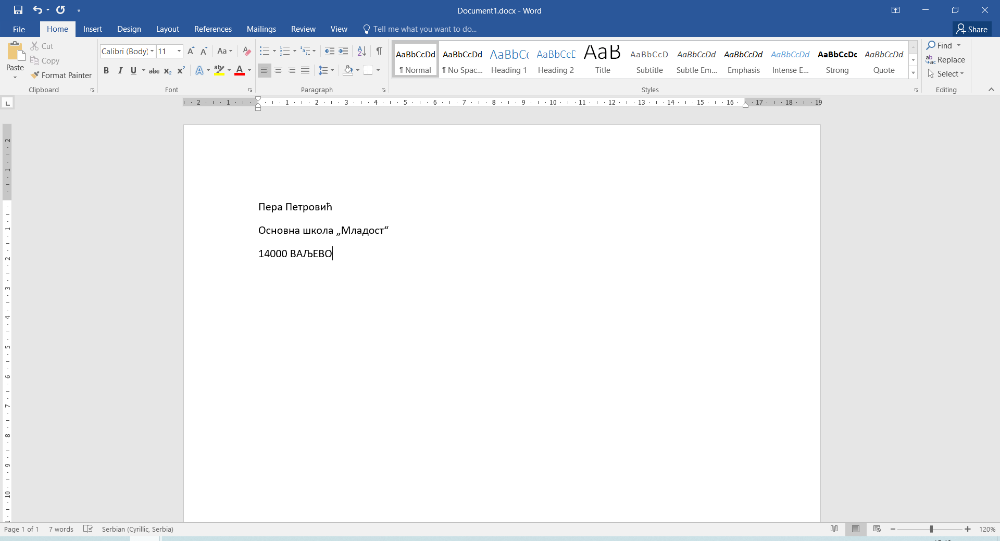

Унос текста
===========

Oбриши сав текст који се налази у документу. Изабери ћириличко писмо ако већ није изабрано.

Напиши једно испод другог:

- своје име и презиме
- назив школе у коју идеш
- поштански број и назив места у којем живиш

.. questionnote::

 Како ћеш да унесеш цифре и знаке?
 

**Цифре** се, осим у нумеричком делу који има већина тастатура (где су распоређене као на калкулатору), 
налазе и **у реду изнад слова**. На овим тастерима, изнад цифре налазе се и неки додатни знаци (**!**,** “**, **#**, **$**, **%**, **&**). 
Када ти је потребан неки од ових знакова, у рачунар га уносиш 
тако што истовремено држиш притиснут тастер **Шифт** (енг. **Shift**) (1) и кликнеш на тастер са знаком који желиш, 
(на пример Шифт + 1 када желиш да укуцаш знак узвика. Исти је поступак и за друге тастере који имају ознаке у два реда - знаци са горњих ознака уносе се у рачунар комбиновањм са Шифтом).

.. questionnote::

 Држи притиснут Шифт тастер и испробај које све знаке можеш да укуцаш комбинујући га са неким другим тастером.

.. suggestionnote::

 Распоред ових знакова, као и распоред тастера за унос тачке, зареза, двотачке, разликују се у зависности 
 од тастатуре и писма које је изабрано.
 
**Без обзира да ли пишеш оловком на папиру или помоћу рачунара, важно је да водиш рачуна о правопису!**

.. infonote::

 Велика слова уносиш у рачунар тако што притиснеш прво тастер Шифт и истовремено укуцаш слово које желиш да буде написано.

Ако је потребно да се унесе дужи текст великим словима, нема смисла да све време држиш притиснут тастер Шифт. 
Кликни на тастер **Капс-лок** (енг. *Caps* ili *Caps Lock*) и настави да куцаш. Сва слова ће бити написана као велика. 
Ако желиш опет да уносиш текст малим словима, кликни поново на Капс-лок.

Исправи малопре  унете податке – измени мало у велико слово где год је потребно. Назив места напиши великим словима, 
као у примеру испод (користи Капс-лок за назив места).

На пример:

.. learnmorenote::

 **Правилна употреба размака (Спејса)**

 Осим између речи, размак се користи и пре или после знакова интерпункције. 
 
 **Отвори било коју страницу књиге или уџбеник и погледај како је укуцан текст.** 
 
 Да ли постоји размак између речи и знака интерпункције (тачке, зареза и сл.)?

 **Основна правила су**:
 
 – Иза тачке, зареза, две тачке, тачка зареза, узвичника, упитника обавезно иде једно поље размака.
 
 **Здраво, Анђела! Како си данас?**
 
 – Размак иде испред и иза речи (или дела текста) који стоји под знацима навода или у загради. (Ако иза наводника или заграде треба да стоји још један знак интерпункције, онда се између њих не ставља зарез.)

 **Драгана иде у Основну школу “Ђура Јакшић” у Зрењанину.**

.. infonote::

 **Додатни тастери**:
 
 **Шифт** (*Shift*) – користиш када желиш да укуцаш велико слово (држиш притиснут овај тастер док укуцаваш слово које желиш да буде написано као велико).

 **Спејс** (*Space bar*) – служи  да унесеш размак између речи или знакова.
 
 **Ентер** (*Enter*) – служи за више ствари. Једна од њих је да пређеш у нови ред када уносиш текст. Користи се и за потврду неке акције у различитим програмима.

 **Капс-лок** (*Caps Lock*) – када укуцаваш комплетан текст или реч великим словима, нема потребе да стално држиш притиснут Шифт. Притиском на овај тастер бираш да ли ћеш писати све великим или малим словима.
 
 **Бекспејс** (*Backspace*) – овај тастер служи да избришеш последњи знак који је укуцан. 

 **Дилит** (*Delete*) – служи за брисање текста који је претходно селектован (означен).

