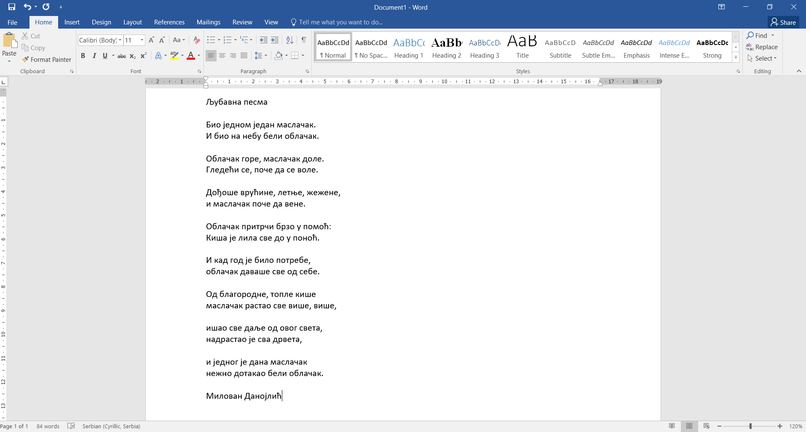
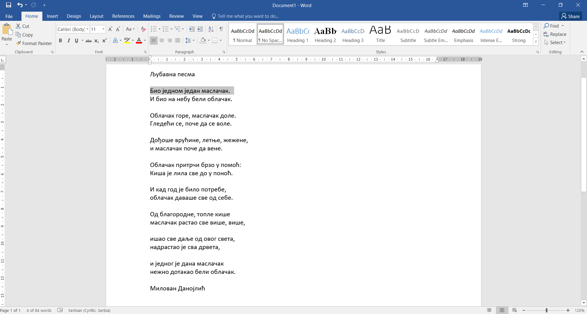
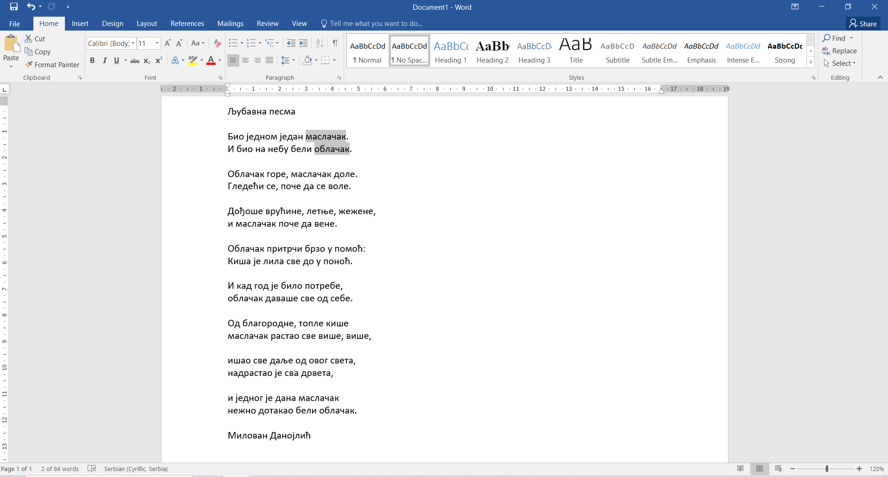
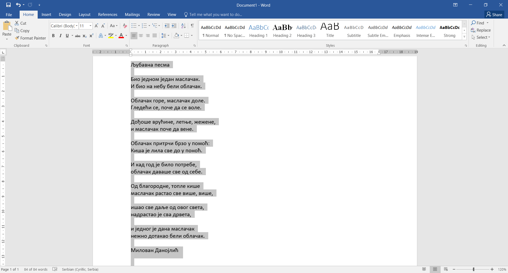

Селектовање текста
==================

.. questionnote::

 Када селектујемо текст?

Када вршиш било какву промену на тексту - мењаш величину слова, боју, облик, истичеш га, бришеш делове, потребно 
је да програму кажеш на које се делове текста та акција односи. То означавање текста назива се **селектовање**.

У прошлој лекцији већ смо рекли смо да делове текста можеш да обришеш тако што ћеш прво да их селектујеш, 
а потом кликнеш на тастер Дилит.

.. questionnote::

 Шта ако треба да обришеш десет страница текста? Или да, из било ког разлога, селектујеш истовремено делове 
 текста који не стоје један уз други?

Постоји више начина да селектујеш делове текста. Објаснићемо их на следећем примеру.

Унеси у документ прве три строфе "Љубавне песме" Милована Данојлића са слике испод.

|

У наставку ћемо навести неколико начина за селектовање текста који ти могу у великој мери олакшати рад.

|

**Слово по слово**

Када желиш да селектујеш само једно слово, кликни на жељено место у тексту и превуции курсор преко њега.

|

**Реч по реч**

Ако желиш да селектујеш целу реч, постави курсор између било која два слова те речи и направи двоклик.

|

**Ред по ред**

Цео ред ћеш селектовати тако што ћеш да кликнеш мишем испред њега, у празан простор са његове леве стране (маргину).

|

**Пасус**

Када желиш брзо да селектујеш цео пасус, потребно је само да урадиш двоклик у празан простор са његове леве стране.

.. suggestionnote::

 Пасус (параграф) представља сав текст (може да буде и само један знак или ред) који је написан (унесен) између два притиснута знака Ентер.

У нашем примеру један пасус је један ред.

---------

Ево још неколико начина за брзо селектовање текста. Овог пута користићемо и тастатуру.

|

**Од - до**

Кликни на почетак текста који желиш да селектујеш. Притисни и задржи притиснут тастер **Шифт**. Кликни иза последњег знака текста који треба да буде селектован. Сав текст који 
се налази између постаће селектован.

|

**Раздвојени делови текста**

.. questionnote::

 Покушај да селектујеш истовремено речи **облачак** и **маслачак**. Шта се десило?

Уради следеће - означи реч **маслачак**. Притисни и задржи притиснут тастер **Ctrl**. Означи мишем реч **облачак**.

.. questionnote::

 Да ли је овог пута селектовање ових речи било успешно?

Раздвојене делове текста селектујеш тако што током њиховог означавања речи држиш притиснут тастер **CTRL**.

|

**Коплетан текст**

Притисни комбинацију тастера **Ctrl + A**. Постаће селектовано све што се налази у документу.

.. questionnote::

 Унеси и остале строфе ове лепе песме и увежбај различите начине селектовања њених делова.

