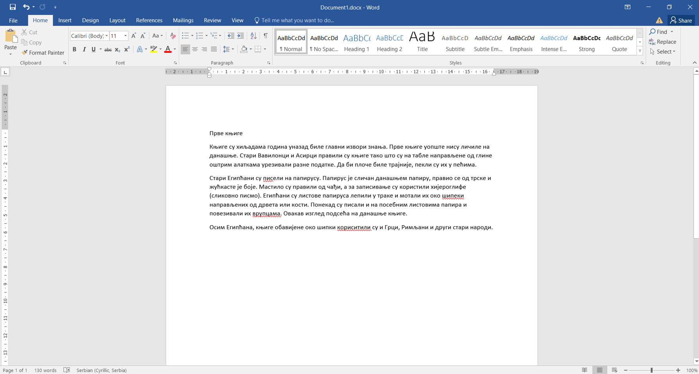
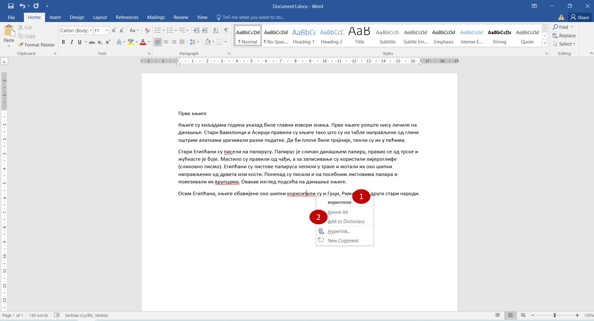
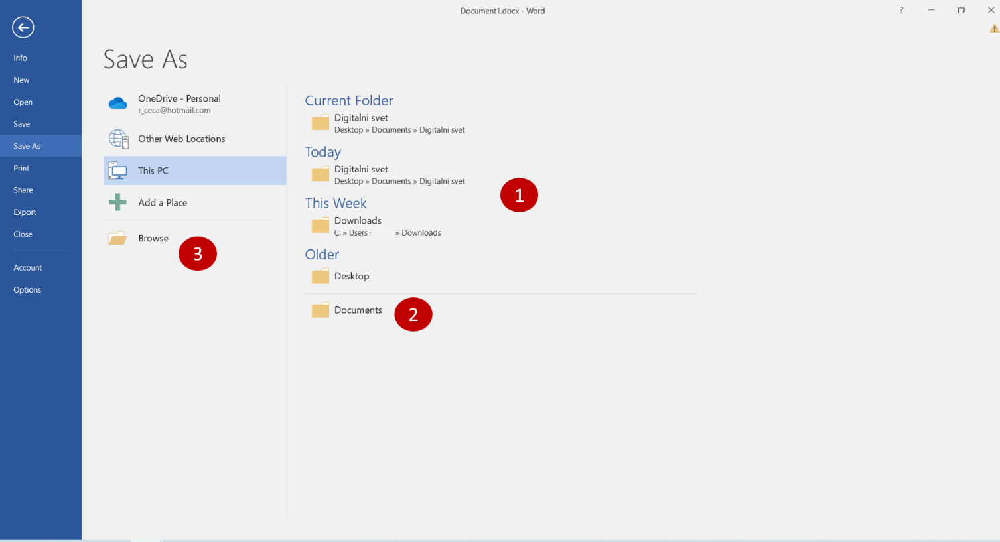
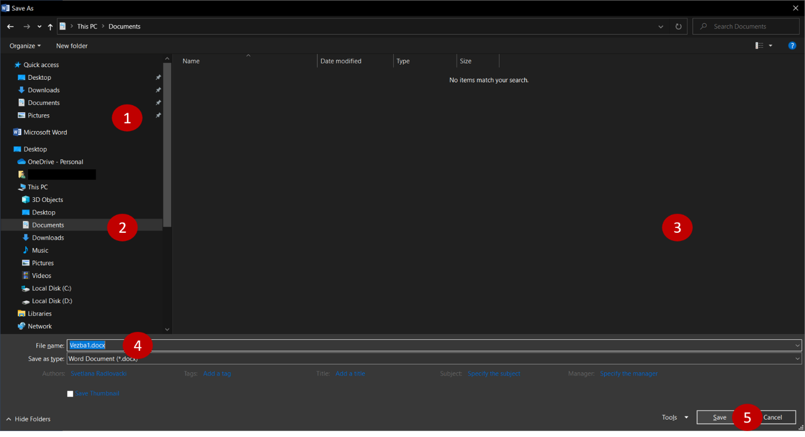

Снимање (чување) документа
==========================

			

У овој лекцији научићеш како да сачуваш свој рад (укуцани текст). Да би могао да снимиш документ, потребно је бар да почнеш
да га правиш. Следећа вежба ће послужити за три ствари - да поновиш и увежбаш како се уноси текст, успут научиш
пар нових и корисних техника и на крају научиш како да сачуваш свој рад да би могао поново да му приступиш. 

Пажљиво прати упутства!

Вежба 1
=======

Отвори нови документ, подеси тастатуру на ћириличко писмо и укуцај **први пасус** (одељак) текста са слике.

Пре него што почнеш да укуцаваш текст, застани мало и размисли…

.. questionnote::

 Покушај да замислиш свет пре него што су се појавили први записи. Како се тада преносило знање? 
 
 Да ли је то било поуздано и да ли је уопште било могуће? 
 
 Да ли знаш како се играју „Глуви телефони“? Ако не, питај родитеље, верујемо да ће ти бити занимљиво!

 
.. questionnote::
 
 Пажљиво погледај текст. Да ли примећујеш неке грешке у куцању? Како си их приметио?

.. suggestionnote::

 У Ворду постоји могућност да се провери да ли је текст исправно унесен. Ако је подешен одговарајући језик, речи које 
 нису исправно написане или нису препознате биће подвучене црвеном таласастом линијом, тако да можеш лакше да их 
 приметиш и измениш. 
 
 Ако кликнеш на подвучену реч десним тастером миша, појавиће се предлози за њену измену (1). 
 Можеш да изабереш неки од предлога (кликнеш на њега) или, ако мислиш да програм није добро проценио, кликнеш 
 на *Ignore All* (2) и оставиш реч непромењену. 
 
 **Имај у виду да и Ворд може да погреши или не препозна неку реч.** Свакако и сам размисли да ли је реч исправно написана. 
 **Прихвати црвену линију само као помоћно упозорење!**
 

 
Наравно, исправи грешке које смо намерно направили!

.. suggestionnote::

 Може се десити да не видиш довољно добро текст који је написан. 
 Притисни тастер *Ctrl* и окрећи точкић (скрол) на мишу у једну, па на другу страну. Шта се дешава?
 
 Као што прави лист папира можеш да приближиш или удаљиш како би лакше прочитао текст, тако и на рачунару можеш да подесиш поглед на документ!
 Често ћеш чути да се то увећање (као да примичеш документ) зове и **зумирање**.
 
.. suggestionnote::

 Дешава се да погрешиш током куцања. Исто тако може да се деси да нешто погрешно и да избришеш. Шта ако избришеш целу страну текста, 
 случајно?
 
 Добра ствар је што скоро увек можеш да одеш један корак уназад и вратиш текст у првобитно стање. 
 
.. infonote::

 Кораке које си направио у већини програма за обраду текста можеш да вратиш уназад комбинацијом тастера **Ctrl** и 
 слова **Z**. 
 
 Када се бар једном вратиш корак уназад, можеш да се крећеш и ка последњем направљеном кораку комбинацијом тастера **Ctrl** и слова **Y**.
 
Покушај ово да урадиш! Да ли је успело?

Ако није, због чега? Погледај које је писмо изабрано на твом рачунару и који распоред тастера му одговара. Провери где се у твом случају налази слово **Z**, а где **Y**?

.. learnmorenote::

 **Враћање корака**

 У Ворду можеш да вратиш кораке и помоћу стрелице |undo| у горњем левом углу прозора. Можеш да се враћаш и више корака 
 уназад, али и да се враћаш ка последњем направљеном кораку кликтањем на другу стрелицу |redo| (појавиће се кад се вратиш бар један корак 
 уназад).  

Десиће се да ће ти за укуцавање неког текста бити потребно више времена него што у том тренутку имаш на располагању.

Можда и ову вежба није још завршена, а приближава се крај часа или негде журиш 

Добра ствар је што све што урадиш можеш да сачуваш и, када ти буде потребно, поново отвориш и наставиш са радом...

			
.. questionnote::

 Да ли водиш свој дневник? Како се то ради?
 
У једну свеску повремено запишеш шта радиш, шта ти се дешава, шта те је обрадовало или насмејало, да ли те је нешто, 
можда, растужило.

Када запишеш своје мисли, оставиш свеску на полицу. После неког времена опет нешто допишеш, а с времена на време 
прелисташ и прочиташ шта је све записано.

Слично је и са школским свескама. Док си у школи, записујеш реченице, белешке, како би могао касније опет да их прочиташ.

**У свесци остаје записана свака реч, али не и на рачунару.**

Ако желиш поново да приступиш документу који правиш, потребно је да га сачуваш, односно **снимиш**. 

Сачувај свој досадашњи рад (први пасус текста који је требало да укуцаш или део текста који је до сада укуцан). Како се то ради?

Када први пут снимаш документ, потребно је да урадиш следеће:
Кликни на *File* у горњем левом углу и  изабери опцију *Save as* (Сними као…). 

Ове жуте иконице које су се појавиле  (1) представљају фасцикле (енг. *Folders*). У њима се чувају документа. Када кликнеш на неку од њих, 
можеш да видиш шта је све у њој до сада сачувано. 

.. suggestionnote::

 Током рада направићеш много различитих докумената. Као што је добро да књиге на полици буду лепо разврстане 
 (како би се лакше пронашла она која ти је потребна) и да за сваки предмет у школи имаш посебну свеску, тако би добро 
 било да већ на самом почетку рада са рачунаром навикнеш да уредно организујеш своје радове!
 
Захваљујући фасциклама много брже можеш да пронађеш своје радове када желиш поново да им приступиш. На пример, 
сва документа можеш да чуваш у фасцикли *Documents* (Документа), цртеже у фасцикли *Pictures* (Слике)...

.. suggestionnote::

 У свакој фасцикли можеш да направиш и додатне фасцикле. Као што користиш одвојене свеске за различите предмете 
 у школи, тако и фасциклу можеш да назовеш по предмету из којих су радови 
 које желиш у њих да снимиш (Математика, Српски, Дигитални свет, Природа и друштво…) О томе ћеш учити у старијим 
 разредима.
 
Пошто у Ворду куцаш документа, за сада ћеш све радове чувати у фасцикли *Documents*. 

Потребно је да објасниш рачунару две ствари – да изабереш фасциклу и да унесеш име које желиш да доделиш свом документу. 
По томе се ово прво снимање разликује од свих наредних.

Са десне стране програм ти нуди неке од фасцикли за које претпоставља да ти могу бити од користи (1) 
(*Current Folder* – тренутна, *Today* – коришћена данас, *Last Week* – коришћена прошле недеље, *Older* – још раније коришћена). 
Ако видиш своју фасциклу (2), можеш одмах да кликнеш на њу. Ако не, кликни на *Browse* да је потражиш!

У оба случаја отвориће се прозор за снимање (слика испод). На левој страни овог прозора налази се списак фасцикли (1). 
Ако већ није изабрана, пронађи и кликни на фасциклу *Documents* (2). У левом делу прозора појавиће се документа или 
неке друге фасцикле које су у њој сачуване (3). У нашем случају их још нема, празна је.

Укуцај име за свој документ *Vezba1* (попуни прозор поред *File name*) (4) и потврди снимање кликом на *Save* (5). 

Документ је сачуван!

   
**Свако следеће снимање** је много једноставније. Када желиш да сачуваш измене, довољно је да кликнеш на сличицу 
дискете |save| (уређаја који се раније користио за чување и пренос докумената и програма), која се налази у горњем 
левом углу прозора. Исто ово можеш да урадиш тако што ћеш кликнути на *File*, па изабрати *Save*. 

.. suggestionnote::

 Ако ти је лакше да све урадиш само преко тастатуре, можеш то да урадиш **Crtl + S** комбинацијом (притиснеш тастер **Ctrl** и 
 истовремено кликнеш на слово *S* на тастатури). 
  
.. infonote::

 Сваки пут када у упутству напишемо комбинацију два тастера са знаком плус између, 
 подразумева се да држиш притиснут први тастер и док га држиш притиснутог, кликнеш на други.  
 
Када желиш да сачуваш документ који је већ снимљен, али под неким другим именом и на другом месту (у другој фасцикли), 
опет то можеш да урадиш тако што ћеш кликнути на *File*, а затим на *Save as*.

.. suggestionnote::

 Док пишеш неки документ, труди се да га што чешће снимаш (сваких неколико минута), како се због нечег 
 непредвиђеног не би десило да изгубиш свој рад.