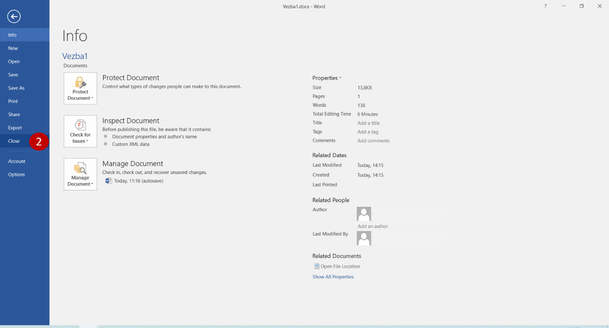

Отварање и затварање документа
==============================

Шта радиш кад се вратиш из школе? Вероватно ручаш, мало се одмориш, а затим поновиш оно што је рађено у школи.
Прво што урадиш када седнеш да учиш јесте да **отвориш** свеску или књигу. Шта радиш са свеском? Прочиташ шта се у њој налази,
Ако имаш неки домаћи - допишеш нешто, исправиш ако је нешто погрешно записано или урађено... Потом је затвориш.

Иста је прича и када радиш на рачунару.

Сваки пут када желиш нешто да запишеш, додаш,обришеш или прочиташ, потребно је да прво **отвориш** документ.
Када завршиш то што радиш, попут свеске, **затворићеш** га.

Отварање документа
------------------

Када покренеш Ворд, на левој страни екрана појави се листа докумената који су недавно коришћени. 
Свој документ отвараш кликом на његов назив (на пример, *Vezba1.docx* на слици испод).

Током времена, овај списак постане прилично дугачак. Ако видиш назив документа који тражиш (1), можеш да наставиш 
са радом. Ако га нема на листи, потражи га! Кликни на *Open Other Documents* (отвори остале документе) (2).  

   
Отвориће се нови прозор.

.. suggestionnote::

 До овог прозора можеш да дођеш и ако већ имаш отворен неки документ. Потребно је да кликнеш на *File*, а затим на *Open*.
 
Када кликнеш на *Browse* (1), oтвориће се прозор сличан оном за снимање документа. 
 

Пронађи са леве стране фасциклу у којој је сачуван и кликни на њу (*Documents*) (1). Пронађи на десној страни прозора 
свој документ (2), изабери га тако што ћеш кликнути на њега и потврди отварање кликом на *Open* (3). 

Затварање документа
-------------------

Постоје два начина да затвориш документ на коме тренутно радиш (слика испод). Први је да кликнеш на крстић у горњем десном углу 
прозора (1). Други начин је да кликнеш на *File*, па изабереш *Close* (2).

   
Ако случајно није сачуван твој досадашњи рад, појавиће се прозорчић са упозорењем да то урадиш. Свакако, требало би већ 
да имаш навику да редовно снимаш своја документа, без упозорења.

.. infonote::

 **Подсетник**:
 
 - **Отварање новог документа**:  *File -> New* 
 - **Отварање већ постојећег документа**: *File -> Open*
 - **Прво снимање документа или снимање под другим називом**: *File -> Save as*
 - **Снимање документа**: *File -> Save*
 - **Затварање документа**: *File -> Close* 
 

   

   

