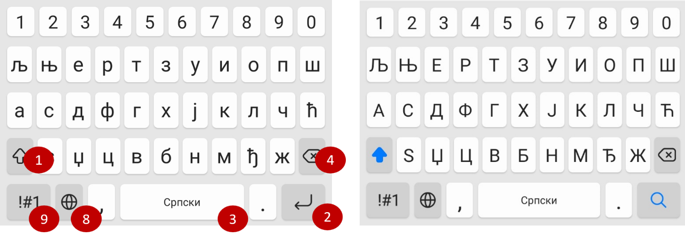

Виртуелна тастатура
===================

За претходно упутство о врстама тастатура и распореду тастера који се на њима налазе користили смо слике **виртуелних тастатура**.

Различити мобилни уређаји (таблети, паметни телефони) имају екран који је осетљив на додир, па се један његов део 
користи као тастатура. Такву тастатуру називамо **виртуелна**. То је, у ствари, програм у уређају који ти омогућава да 
унесеш неки текст или извршиш (потврдиш) неке радње.

Виртуелна тастатура је врло слична физичкој тастатури (тастатури твог рачунара). Нема механичке тастере, али има 
слике дугменца, које, кад додирнеш, добијеш исти ефекат као кад притискаш праве тастере. Распоред дугменца и њихова функција веома су слични код обе тастатуре.

На слици испод су редом означена следећа дугменца:

1 – Шифт

2 – Ентер

3 – Спејс

4 – Бекспејс

Ова четири дугмета имају исту улогу као и тастери на правој тастатури. 

Мала разлика је у примени  Шифта. 
Сваким кликом на ово дугменце мењаш начин на који ћеш уносити будући текст. Бираш између три ствари: 
да ли ћеш све писати малим словима, да ли ће само следеће слово бити велико или ће сва наредна слова бити велика 
(као кад притиснеш Капс-лок на тастатури). 

Осим ова четири, на слици је означено и дугменце за промену језика (8), као и дугменце које омогућава да укуцаш 
различите знакове (симболе) (9).

   
.. learnmorenote::

 **Виртуелна тастатура на рачунару**
 
 Виртуелну тастатуру можеш да користиш и на свом рачунару. Притисни истовремено тастере са ознакама **Ctrl**, |win| и слово **О** и појавиће се на екрану. 
 Oзнаке на тастерима биће распоређене у зависности од писма које користиш. 

.. infonote::

 **Подсетник:**

 - **Размак**: Space
 
 - **Прелазак у нови ред**: Enter
 
 - **Велико слово**:  Shift + слово
 
 - **Сва велика слова**: Caps Lock
 
 - **Знак**: Shift + тастер цифре или неки други који садржи знак у горњем делу

.. suggestionnote::

 **Правилно куцање**
 
 |
 
 Важно је да већ на самом почетку научиш како да правилно користиш тастатуру. Постоје бројни програми који ти могу помоћи да то и увежбаш.

 На слици испод можеш видети којим прстом, по правилу, треба да притиснеш који тастер.
 
 .. image:: ../../_images/raspored.png
   :width: 400
   :align: center