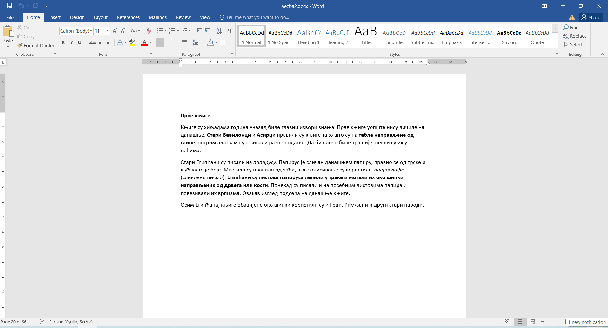
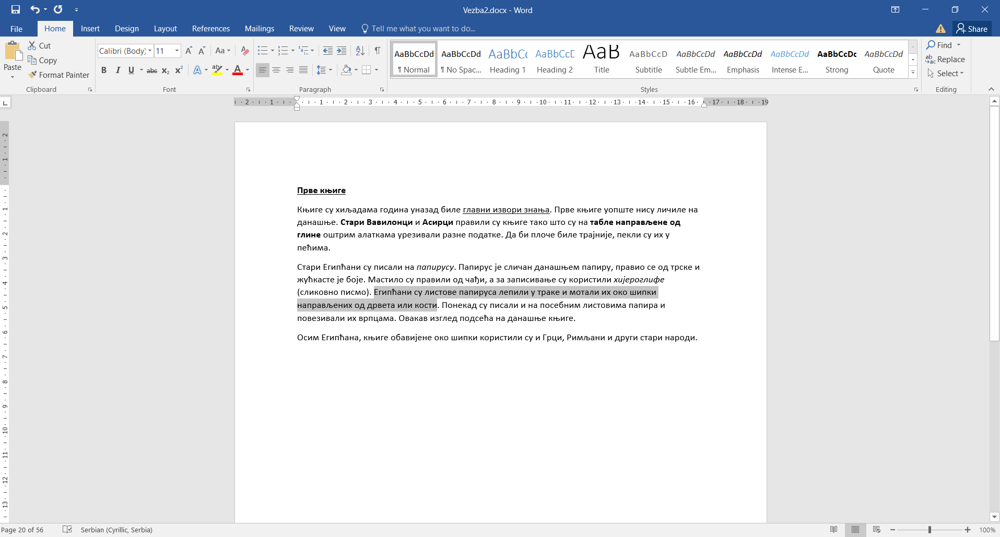
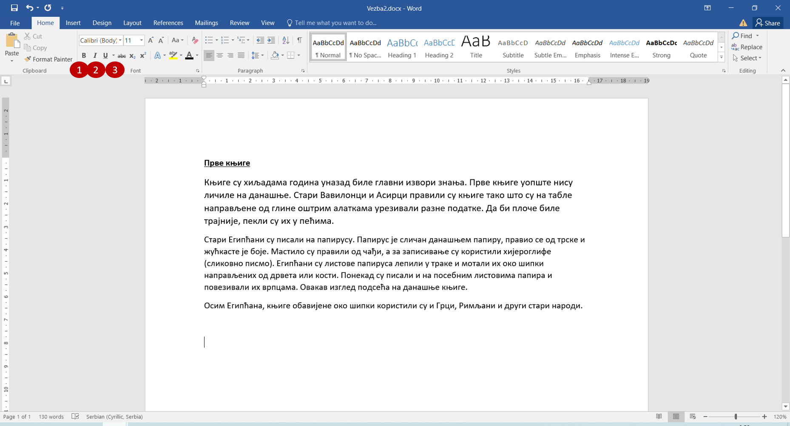

Истицање текста
===============

			
Рецимо да пишеш подсетник за неку лекцију. Све је лепо написано, читко је, али и даље није прегледно. 
Како би боље запамтио неке детаље, често је потребно да некако визуелно издвојиш оно што је важно, да истакнеш делове текста.

На које све начине можеш да истакнеш неки део текста?

Три врло једноставне могућности су:

- да подебљаш текст
- да искосиш текст
- да подвучеш текст

Вежба 2
-------

Врати се на **Вежбу 1**. Отвори документ *Vezba1.docx* (уколико већ није отворен) и укуцај остатак текста.

Сачувај допуњен документ у исту фасциклу као и претходни, али овог пута под називом *Vezba2.docx.* 
(користи опцију *Save as*).

.. suggestionnote::

 Још једном те подсећамо да помоћу *Save as* можеш да снимиш нову верзију истог документа под другачијим именом. 
 На тај начин остаће ти сачуван и почетни документ и исправљена верзија (у нашем случају *Vezba1.docx* и *Vezba2.docx*)
 
Погледај пажљиво слику испод. Приметићеш да су делови текста подебљани, слова неких рећи укошена, а неке речи и подвучене. 
Како се то ради?

Ако је текст већ унесен у рачунар, када правиш било какву измену, потребно је да прво селектујеш делове (или речи) 
над којима то желиш да урадиш.

.. suggestionnote::

 Дешава се да треба да направиш неку измену на целом тексту у документу. Када желиш да селектујеш све што је написано, 
 то једноставно можеш да урадиш комбинацијом **Ctrl + A**.
 
Истицање текста можеш да урадиш на више начина. Први је **преко тастатуре**. Крећемо од овог начина зато што су ове 
пречице универзалне за скоро сва окружења у којима се обрађује текст.

- да подебљаш -  комбинација **Ctrl + B**
- да укосиш - комбинација **Ctrl + I**
- да подвучеш - комбинација **Ctrl + U**

Наравно, измене ће бити видљиве на тексту који је претходно селектован.

.. learnmorenote::

 **Зашто B, I, U?**
 
 Ово су почетна слова речи енглеског језика која означавају следећу врсту слова:
 
 
 **B** (енг. *Bold*) - подебљано (назива се и "масно" слово)
 
 **I** (енг. *Italic*) - укошено, закривљено (назива се и "курзив")
 
 **U** (енг. *Underline*) - подвучено 
 

   
Ево и другог начина. У Ворду се у главном менију налазе и ова дугменца |biu|. По слову, али и начину на који је написано,
можеш да закључиш чему које од њих служи. Прво (слика испод) је да подебљаш текст, друго да га укосиш, а треће да 
подвучеш.   
 

Када завршиш све измене у документу, сачувај га под истим именом (*Vezba2.docx*)

.. learnmorenote::

 **Наставак у називу документа**
 
Уз име сваког документа налази се и наставак *docx*. То је скраћена ознака (често ћеш чути назив **екстензија**) коју додаје Ворд, да би се 
знало да је у питању неки документ. *docx* није једини, постоје и други типови текстуалних докумената 
(на пример, *txt*, *pdf*), али се њима у овом приручнику нећемо бавити. 

