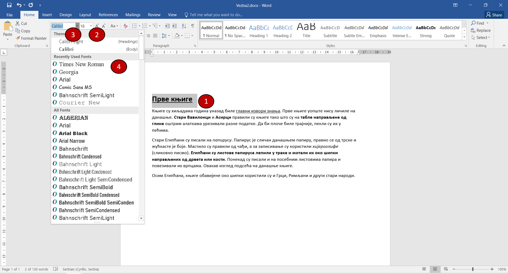
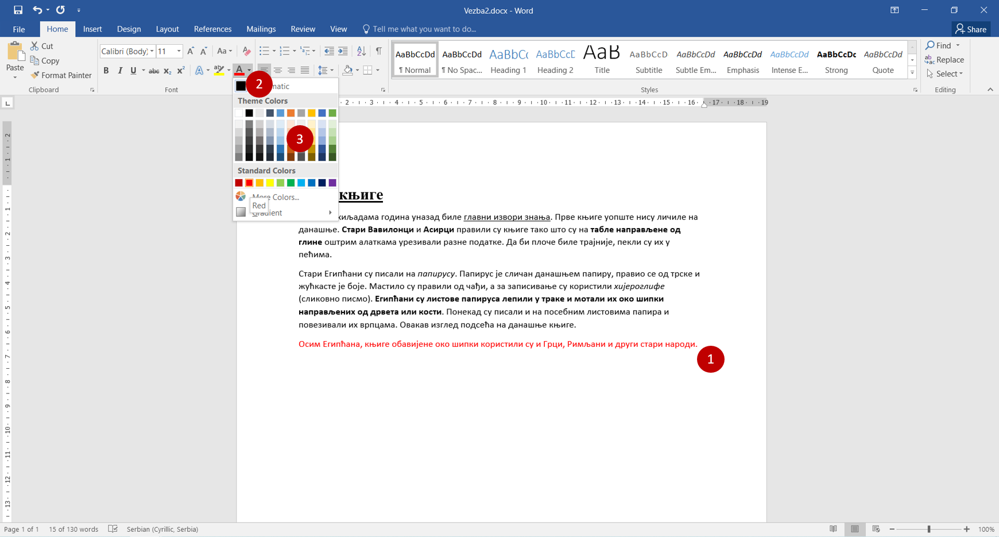

Промена величине, облика и боје слова
=====================================

У свесци можеш да пишеш штампаним и писаним словима. Слова могу да буду округла, дугуљаста, нагнута у једну или другу страну. Различити људи имају 
различите рукописе. 

Слично томе, када уносиш текст у рачунар можеш да изабереш облик слова која користиш. 

У рачунару постоје различити **фонтови**. То су групе знакова које имају заједнички графички облик.

Показаћемо ти како се мења облик слова на примеру из претходне вежбе. 

|

Отвори поново документ *Vezba2.docx*.

На пример, измени наслов. Треба да промениш величину слова на 18 и да промениш фонт у *Times New Roman*.

Селектуј текст (1). Кликни на стрелицу  поред оквира у који је уписан број (2). Из листе бројева која се појавила изабери број 18. 
Да ли се повећао наслов?

Сада промени облик слова. Кликни на стрелицу поред оквира помоћу ког бираш фонт који желиш да користиш (3). У листи која се 
појавила пронађи *Times New Roman* и кликни на њега. Да ли су слова променила облик?

Селектуј сада и друге делове текста и мењај облике и величину њихових слова.

Као што, док пишеш на папиру, понекад користиш дрвене бојице или фломастере различитих боја, тако и у Ворду можеш да мењаш боју 
слова. Како се то ради? Прати слику испод.

Селектуј део текста, на пример, последњи ред (1). Кликни на дугменце са ознаком подвученог слова А (2).
Појавиће се палета различитих боја (3). Кликни на квадратић са бојом којом желиш да буде написан текст, нпр. црвени. 

Реченица која је селектована сада је написана словима црвене боје.

|

Увежбај промену величине, облика и боје слова! 

Промени боју наслова у плаво. Означи речи које представљају имена народа зеленом бојом. Повећај реч *хијероглифе* на 36.

.. infonote::

 Ако користиш превише различитих врста фонтова и боја у свом документу, документ може да постане врло непрегледан и нечитљив. 
 
 **Води рачуна да садржај увек буде на првом месту!** 
