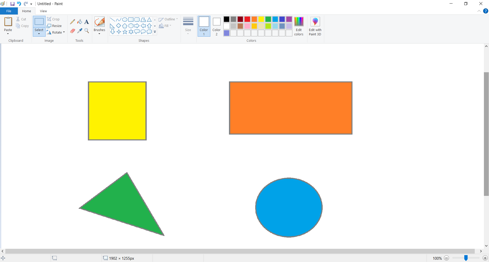
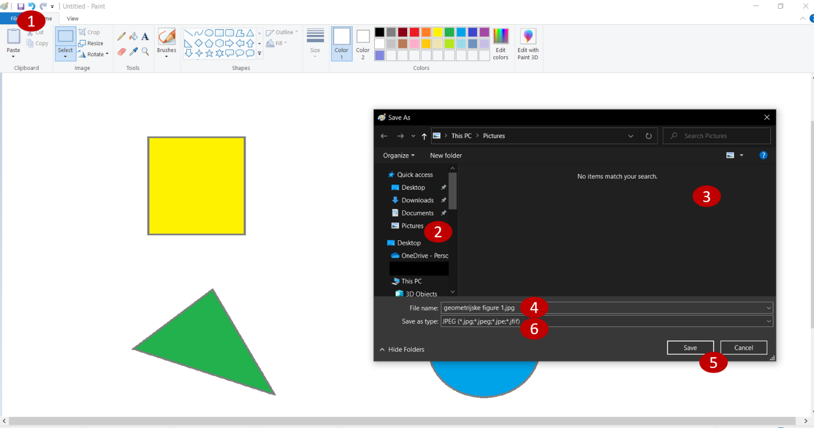
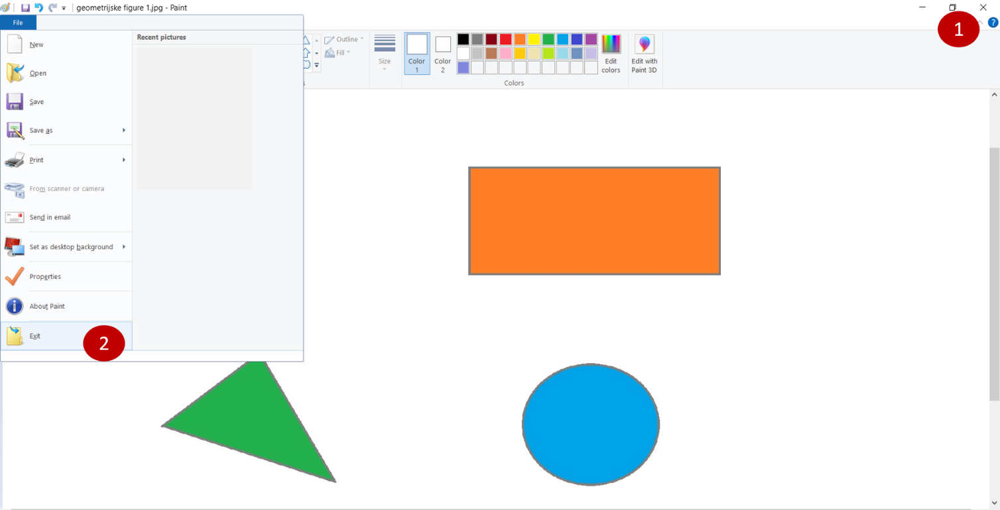

Слика и текст - увод
====================

Током прошле године научио си како се црта на рачунару. Бојице, темпере, фломастере, замењене су алаткама у програму 
**Бојанка** (*Paint*). Уместо цртања помоћу лењира користиш већ предложене облике.

Кажу да једна слика вреди хиљаду речи, али је, исто тако, понекад довољна само једна реч да објасни све што је на слици.

Рецимо да желиш да направиш украсну позивницу за рођендан или честитку за Нову годину, подсетник за Природу и друштво 
или Математику. Шта је заједничко за све њих? 
Осим различитих облика на њих треба додати и неки текст.

Често ће бити потребно да комбинујеш слике и текст. Правићеш различите постере, подсетнике, цртаћеш мапе и графиконе, 
писаћеш обавештења и позивнице.

Како се додаје текст на слику? 

Пре него што објаснимо како се то ради, подсети се како се црта на рачунару. 

.. questionnote::

 Oтвори Бојанку и нацртај основне геометријске облике – квадрат, правоугаоник, троугао и круг.

   
Можеш да наставиш са радом. Потребно је да додаш наслов ГЕОМЕТРИЈСКЕ ФИГУРЕ и напишеш назив испод сваке фигуре коју си 
нацртао. Пре него што направиш било какву даљу измену, сaчувај свој досадашњи рад. 

Снимање у Бојанци радиш на исти начин као и у Ворду. Кликни на *File* (1), a потом на *Save as*. 

Већ смо писали о томе како је важно да твоји радови буду лепо организовани. За чување слика најчешће се користи 
фасцикла *Pictures* (слике). Ако није отворена, пронађи је у листи са леве стране прозора (2) и кликни на њу како би 
био приказан њен садржај. У нашем случају још ништа није сачувано у њој, празна је (3). 

Изабери име под којим желиш да сачуваш слику, на пример, *geometrijske figure 1.jpg* (4) 

Потврди снимање кликом на *Save* (5).

За свако следеће снимање (под истим именом и у истој фасцикли) довољно је да кликнеш на дугменце са дискетом |save| 
или на *File*, па *Savе*.

.. suggestionnote::

 Испод оквира за унос назива цртежа налази се оквир који служи да изабереш ког ће типа бити твој цртеж (6). О овоме 
 ћеш учити у старијим разредима. За сада је довољно да знаш да су (као што је за документ *.docx*) *.jpg* и *.png* 
 скраћенице за врло често коришћене типове (формате) слика.

Ако желиш да отвориш потпуно нови цртеж, кликни на *File*, a затим на *New*. Ако нису сачуване измене претходног, 
који је тренутно отворен, појавиће се порука која ће на то да те упозори.

Из Бојанке, као и из осталих програма, можеш да изађеш на два начина – први је да кликнеш на крстић у горњем десном 
углу, а други да кликнеш на *File*, a затим на *Exit*. Изађи из програма!

