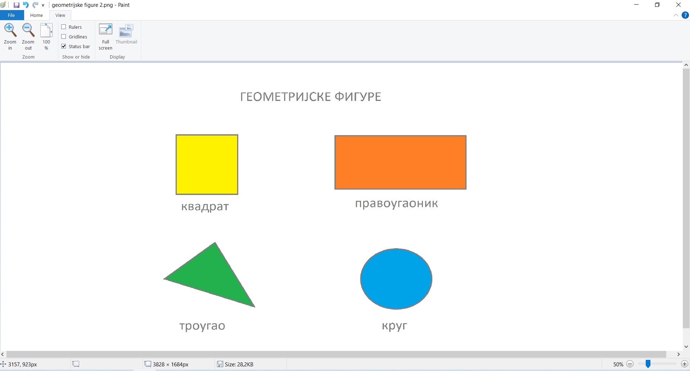

Додавање текста на слику
========================

Као што смо рекли, оно што треба да урадиш јесте да додаш текст на слику. Отвори поново свој цртеж 
(*geometrijske figure 1.jpg*).

Додај, на пример, наслов. Када желиш да додаш текст на слику, потребно је да кликнеш на дугменце са 
ознаком *А* (1), а затим на место на слици где текст треба да буде постављен (2).

   
Када кликнеш на место на цртежу где желиш да поставиш текст, у менију ће се појавити нове ставке. 
Видећеш да веома подсећају на оне са којима си се срео у Ворду. Идемо редом:

  
Помоћу стрелице која се налази уз оквир са текстом (1) можеш да изабереш **фонт** (облик слова, знакова) којим желиш да 
твој текст буде исписан.

Можеш да подесиш **величину слова**. То, као и у Ворду, радиш помоћу оквира за текст у ком се налази број (2). Када кликнеш на стрелицу поред оквира, 
појавиће се листа бројева. Потребно је само да изабереш коју величину слова желиш.

Текст који укуцаш, и у овом програму **можеш да истакнеш** - подебљаш га, искосиш, подвучеш, прецрташ. (3).
Његова **позадина** може да остане провидна (транспарентна) или да буде одређене боје. 

Ако желиш да остане провидна, кликни на дугменце са натписом *Transparent*, а ако желиш да буде обојена, клик на *Opaque*. (4)

Укуцај било коју реч. Селектуј слова која си унео и промени облик и величину слова. Кликни било где са стране на површину цртежа.

Покушај поново да измениш фонт или да избришрш неко слово. Да ли може то да се уради?

.. infonote::

 Када унесеш текст и изађеш из његовог оквира, он се уклопио у цртеж и **програм га више не препознаје као текст**. Можеш
 само да му приступиш као делу цртежа и тако га премешташ (дугменце *Selection*) или бришеш (гумицом, дугменце *Eraser*) (учили сте прошле године).

.. questionnote::

 Да ли и у овом програму можеш да мењаш боју слова? 

Наравно! Осим различитог облика слова, текст може бити и **различите боје**

Одмах са десне стране дугмића које смо објаснили налази се палета боја (погледај поново слику) (6). Можеш да бираш две боје, означене са *Color 1* и *Color 2*. 

Кликни прво на одговарајуће дугменце, а потом на квадратић који је обојен оном коју желиш да употребиш.

Прва боја (*Color 1*) служи да изабереш **боју текста**, а друга (*Color 2*) да изабереш **боју његове позадине** (ако не желиш да буде провидна).

Ова подешавања облика и боје можеш да урадиш пре него што укуцаш текст, а можеш и када је већ укуцан. 

Услов је да је текст још увек "активан", да блинка курсор у његовом оквиру. 
Да би се виделе измене на већ укуцаном тексту, потребно је да га прво селектујеш, па тек онда изабереш како ће изгледати.

Можеш да наставиш са радом. Додај наслов (изабери фонт, боју и величину слова по жељи) и називе геометријских фигура које се налазе на цртежу.

   
Сачувај ове измене као *geometrijske figure 2.jpg* у истој фасцикли у којој се налази и прошли цртеж.

.. suggestionnote::

 У другом полугодишту научићеш обрасце за израчунавање обима фигура. Тада можеш да се вратиш на овај документ, допишеш 
 обрасце и тако направиш себи прегледан подсетник.

.. infonote::

 **Подсетник**:

 - **Отварање новог цртежа**:  *File -> New* 
 - **Отварање већ постојећег цртежа**: *File -> Open*
 - **Прво снимање цртежа или снимање под другим називом**: *File -> Save as*
 - **Снимање цртежа**:  *File -> Save*
 - **Затварање цртежа**: *File -> Exit*
 - **Додавање текста**: дугменце са ознаком **А**, па клик на место где треба да буде постављен

