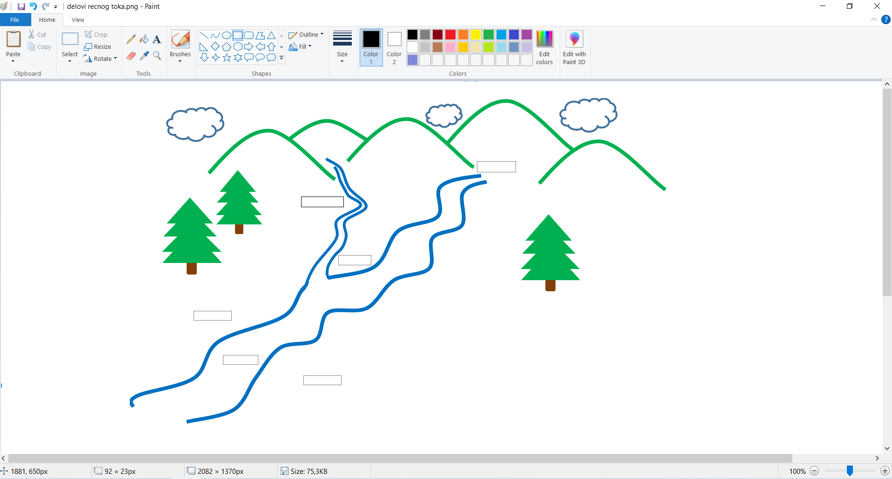

Вежбe
=====

Вежба 1
-------

.. questionnote::

 Отвори нови цртеж. Нацртај своје омиљено превозно средство и напиши његов назив. У доњем десном углу цртежа напиши 
 своје име и разред, као што је урађено у примеру испод.
 

   
Вежба 2
-------

Из Природе и друштва проучавали сте рељеф и површинске воде. Због чега је вода значајна за живи свет? 
Које су највеће реке у Србији? Пре него што почнеш са израдом овог задатка, понови које су основни елементи речног тока.

.. questionnote::

 Нацртај један леп предео кроз који протиче река. У реку се улива једна притока. Када завршиш цртеж, допуни га тако што ћеш следеће појмове распоредити на одговарајућа места:
 
 - извор, 
 - ушће,
 - ток, 
 - лева обала, 
 - притока, 
 - десна обала.
 
Као пример ти може послужити следећа скица… сигурни смо да ћеш ти задатак урадити много боље и детаљније!

Цртеж сачувај као *delovi recnog toka.png* на истом месту где су сачувани и твоји претходни цртежи.   

Вежба 3
-------

Пре него што почнеш да радиш следећи задатак, присети се својих јучерашњих оброка. 
Шта је било на тањиру за доручак, ручак, вечеру, шта се налазило у чаши?
Направи списак свих намирница и састојака за које знаш да су искоришћени за твоје оброке, а затим их 
разврстај на здраве и нездраве. 

.. questionnote::

 Твој следећи задатак повезан је управо са темом здраве исхране. Нацртај један свој оброк (тањир са чорбицом и/или 
 главним јелом, поред тога десерт, пиће, можеш и само намирнице). Испод слике напиши од чега се све састоји. Називе воћа и поврћа које се 
 налази у оброку напиши плавом бојом.
 
Колико често једеш брзу храну? Размисли колико се здраво храниш и да ли можеш нешто да промениш по том питању… 

Немој губити из вида да је здрава исхрана врло важна за децу у развоју!

Сачувај свој цртеж као ishrana.png у фасцикли *Pictures*.
