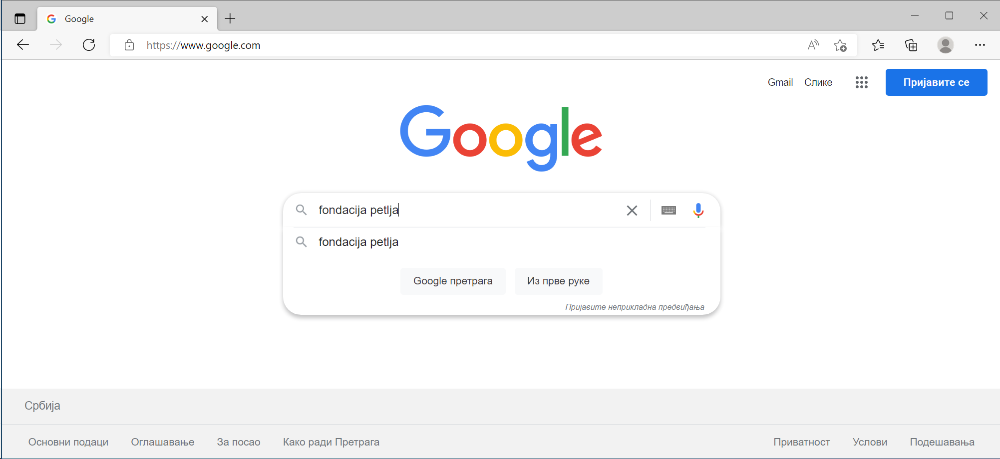

Прегледач и претраживач
=======================

.. questionnote::

   Коју апликацију користиш да ви читао текст ове лекције на свом дигиталном уређају?

Ако си сам покренуо апликацију сети се како се зове, а ако ти не неко помогао замоли да ти покаже како је покренуо апликацију. Апликација коју користиш се 
највероватније зове Хром, Еџ, Фајерфокс или Опера. То су четири најпознатија прегледача веба. 

Прегледач веба се користи да би се приказао садржај веб-места. Сусрео си се до сада са веб-местима, као што је веб-место твоје школе, веб-место `https://www.google.com`
или Петљино веб-место `https://petlja.org` .

.. infonote:: 

   **веб-место**, **веб-сајт** или скраћено **сајт**

   Све то има исто значење. У свакодневном говору можеш чути сва три назива.

На следећој слици је прегледач у коме је приказано Петљино веб-место.

.. image:: ../../_images/pregledac-petlja-org.png
   :width: 780
   :align: center

Пронађите на слици где у адресној линији прегледача пише `https://petlja.org`. То је адреса веб-места које се приказује. Веб адреса може да се пише и без `https://`, 
што би у овом случају било `petlja.org`. 

.. infonote:: 

   Пази, тачна на крају реченице није део адресе веб-места. 
   Дешава се, као у тексту изнад, да се адреса појави на крају реченице и да тачка уз адресу означава крај реченице.

.. infonote:: 

   Aдреса веб-места у прегледачу ти је једина поуздано говори где се налазиш.

   Све друго што се приказује неко лако може да копира и лажно ти подметне.

Нађи у свом прегледачу стрелицу која се у прегледачу налази лево од адресе и показује улево. Запамти да на ту стрелицу треба да кликнеш када се вратиш назад. 

Ако си запамтио како се враћаш назад, отуцај у адресној линији адресу неког другог веб-места и врати се назад. Откуцај на пример `www.google.com` па се врати назад.

Рекли смо ти да се вратиш назад за случај да у истом прегледачу читаш овај текст и уносиш адресу. Ако ти је неко отворио још један прегледач или сам знаш  како се
то ради онда можеш у другом прегледачу да испробаваш.

Веб-место `www.google.com` ти је важно ако тражиш неки садржај а не знаш адресу веб-места. Иди опет на `www.google.com` и у пољу за претрагу откуцај `fondacija petlja` .
Možeš i ćirilicom ako želiš. На слици испод видиш како изгледа тренутак када си укуцао `fondacija petlja` .

Након што си откуцао `fondacija petlja` притисни тастар Ентер и добићеш резутате претраге као што је приказано на следећој слици.

.. image:: ../../_images/google-petlja-rezultati.png
   :width: 780
   :align: center

У примеру са слике смо имали среће и добили смо жељени резултат на првом месту. То се не дешава увек, наравно.

Кажемо да је `www.google.com` претраживач веба. То није једини претраживач, али јесте најпознатији. Чак је по Гуглу у свакодневни говор ушла и реч "гуглање" која 
значи тражење уз помоћ веб претраживача. Други најпознатији претраживач је Бинг на адреси `www.bing.com` .

Веб претраживач можеш да добијеш ако у адресној лини прегледача откуцаш то што тражиш уместо веб адресе. Тада те прегледач пебаци на претраживач који он хоће.

Због тога што у адресној линији прегледача можеш одах да куцаш и шта желиш да тражиш у претраживачу, многи људи нису научили да разликују прегледач од претраживача
А ти си сада научио.

.. |win| image:: ../../_images/windows.png
            :width: 100px
			
   
Задатак 1
---------

.. questionnote::
 
 - Које претраживаче знаш?
 - Који ти користиш за претраживање на интернету? 
 - Шта је заједничко за све њих?
 
Задатак 2
---------

За домаћи задатак истражи и својим речима дефиниши појмове веб прегледач и интернет претраживач и објасни њихову улогу.

