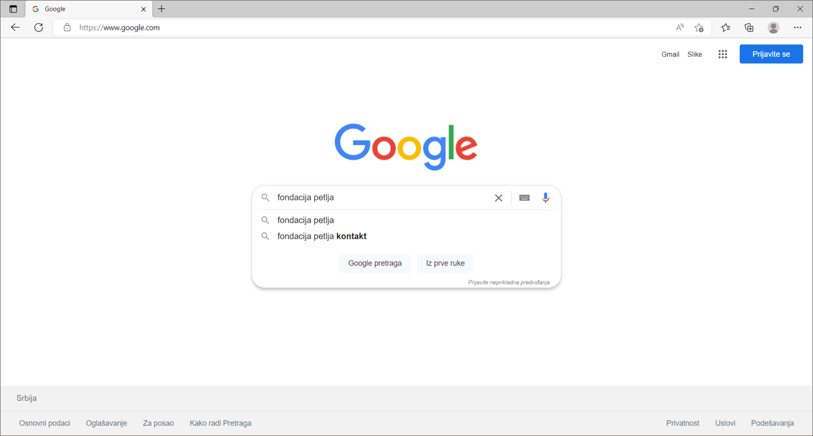

Прегледач и претраживач
=======================

.. questionnote::

   Коју апликацију користиш да би читао текст ове лекције на свом дигиталном уређају?

Ако си сам покренуо апликацију пробај да се сетиш како се зове, а ако ти је неко помогао замоли да ти покаже 
како је покренуо апликацију. Апликација коју користиш се 
највероватније зове **Хром**, **Еџ**, **Фајерфокс** или **Опера**. То су четири најпознатија прегледача веба. 

Прегледач веба се користи да би се приказао садржај веб-места. Сусрео си се до сада са веб-местима, као што је веб-место твоје школе, веб-место `https://www.google.com`
или Петљино веб-место `https://petlja.org` .

.. infonote:: 

   | За **веб-место** ћеш чути и да га зову **веб-сајт** или краће **сајт**,
   | а за **прегледач веба** ћеш чути да га зову  **веб-браузер** или краће **браузер**.

   У свакодневном говору можеш чути различите називе за исту стар.

На следећој слици је прегледач у коме је приказано Петљино веб-место.

.. image:: ../../_images/pregledac-petlja-org.png
   :width: 780
   :align: center

Пронађи на слици где у адресној линији прегледача пише `https://petlja.org`. 
То је адреса веб-места које се приказује или краће веб-адреса. 
Веб-адреса може да се пише и без `https://` на почетку, 
на пример само `petlja.org` . 

.. infonote:: 

   | Веб-адреса у прегледачу ти **једина поуздано говори где се налазиш**.

   Све друго што се приказује неко лако може да копира и лажно ти подметне.

Нађи у свом прегледачу стрелицу која се налази лево од веб-адресе и показује улево. 
Запамти да на ту стрелицу треба да кликнеш да би се вратио назад. 

Ако си запамтио како се враћаш назад, отуцај у адресној линији адресу неког другог веб-места и врати се назад. Откуцај на пример `www.google.com` па се врати назад.

Рекли смо ти да се вратиш назад за случај да у истом прегледачу читаш овај текст и уносиш адресу. Ако ти је неко отворио још један прегледач или сам знаш  како се
то ради онда можеш у другом прегледачу да испробаваш. У наредној лекцији ћемо те научити као можеш да отвориш
прегледач веба.

Веб-место `www.google.com` ти је важно ако тражиш неки садржај а не знаш веб-адресу. Иди опет на `www.google.com` и у пољу за претрагу откуцај `fondacija petlja` .
Možeš i ćirilicom ako želiš. На слици испод видиш како изгледа тренутак када си укуцао `fondacija petlja` .

Након што си откуцао `fondacija petlja` притисни тастар Ентер и добићеш резутате претраге као што је приказано на следећој слици.

.. image:: ../../_images/google-petlja-rezultati.png
   :width: 780
   :align: center

У примеру са слике смо имали среће и добили смо жељени резултат као прво што је нађено,
што се не дешава увек.

Кажемо да је `www.google.com` претраживач веба. То није једини претраживач, али јесте најпознатији. 
Други најпознатији претраживач је Бинг на адреси `www.bing.com` .

.. infonote::

   Po претраживачу Гугл је у свакодневни говор ушла реч "гуглање" која 
   значи тражење уз помоћ претраживача веба. 

Постоји још један начин да дођеш до претраживача веба. Уместо веб-адресе у прегледачу можееш да откуцаш
нешто што тражиш. Тада ћеш бити пребачен на претраживач и одмах видети резултат претраге. 

Због тога што у адресној линији прегледача можеш одах да куцаш шта желиш да тражиш, 
многи људи нису научили да разликују прегледач од претраживача. А ти си сада научио.

   
Задатак 1
---------

Одговори на пуитања:
 
- Које претраживаче знаш?
- Који ти користиш за претраживање на интернету? 
- Шта је заједничко за све њих?
 
Задатак 2
---------

За домаћи задатак истражи и својим речима дефиниши појмове прегледач веба и претраживач веба и објасни њихову улогу.

