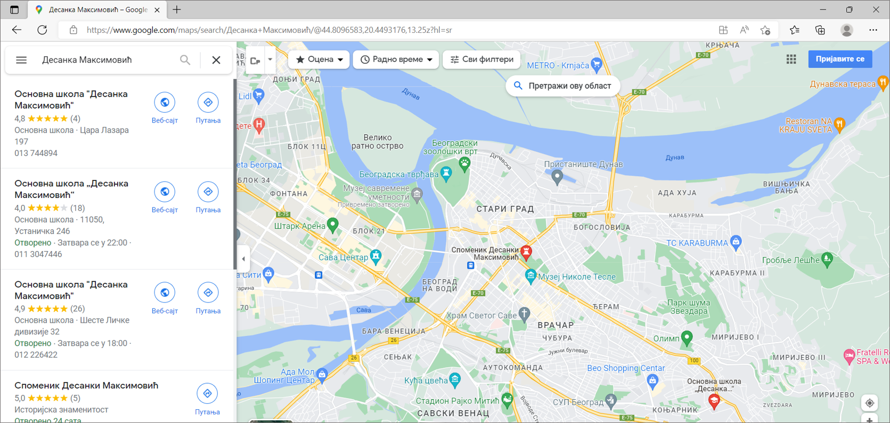

Како претраживати
=================

Како би се на интернету пронашла жељена ствар треба паметно да изабереш које ћеш речи унети у претраживач. 

У прошлој лекцији си научио шта је прегледач, а шта претраживач. Сада ћемо кренути од почетка, како да
покренеш прегледач.

Са радне површине свог рачунара можеш покренути прегледач веб-а тако што кликнеш на иконицу прегледача. На
следећој слици имаш радну површину са иконицом за Мајкрософтов Еџ (број 1 на слици):

.. image:: ../../_images/pi_3.png
   :width: 780
   :align: center

Уколико се деси да прегледач није на радној површини можеш да кликнеш на ознаку |win| у доњем 
левом  делу екрана. 
Када ти се отвори листа програма у њој можеш пронаћи жељени прегледач. Сети се упутства шта радиш када се
Ворд не налази на радној површини.

Када ти се отвори прегледач у адресној линији унеси веб-адресу  претраживача. 
Нека то поново буде  `www.google.com`. Наредни корак је да унесеш оно што желиш да пронађеш, што си већ
радио у претходној лекцији. Рецимо да те овога пута занима да пронађеш нешто више o Јовану Цвијићу. 
Откуцај његово име и презиме у пољу за претрагу и када притиснеш Ентер добићеш
резултате:

.. image:: ../../_images/pi_8.png
   :width: 780
   :align: center

Кључне речи
-----------

Речи које користиш за претрагу зову се **кључне речи**. Ове речи треба да одабереш тако да на најлакши начин 
објасниш претраживачу шта желиш да пронађе за тебе. Након што укуцаш жељене кључне речи у претраживач и 
притиснеш Ентер, приказаће се резултати претраге.

Веома је важно да кључне речи буду прецизне и да дају јасан захтев шта тражиш. 

Уколико, рецимо, из српског учиш о придевима и желиш да сазнаш што више о њима и да нађеш различите примере, шта ћеш унети у претраживач?
Ако унесеш кључну реч *Придеви* добићеш велики број информација.
Имајући у виду да су претраживачи напредовали временом кључну реч слободно можеш унети и ћирилицом.

Замисли да имаш задатак да помоћу интернета истражиш што више о својој школи. Идеш у Основну школу „Вук Караџић“ 
у Београду и знаш да твоја школа има детаљан сајт. Ако укуцаш Вук Караџић изаћи ће следеће:

.. image:: ../../_images/pi_9.png
   :width: 780
   :align: center

.. questionnote::
 
   Шта мислиш због чега?
 
Сигурно знаш да је Вук Караџић веома важна историјска личност наше земље и на интернету ће у претрази прво изаћи 
списак страница на којима се налазе подаци који су у вези са његовим животом и радом.

Али, ако пробаш да тражиш Основна школа Вук Караџић Београд, онда ће се сајт школе појавити на врху резултата претраге.
 
Управо је то циљ кључних речи. Да се укуца тачно оно што ти треба и тиме уштеди време и добију тачно жељени подаци. 
То не морају бити комплетне реченице, већ само издвојене речи које ће ти помоћи у проналажењу жељеног материјала!

.. questionnote::

   Твој друг из одељења Никола Петровић освојио је прво место на републичком такмичењу из математике. Знаш да су новине писале о томе. 
   У претраживач је унето само Никола и изашло је следеће:

   .. image:: ../../_images/pi_11.png
      :width: 780
      :align: center
 
   Шта мислиш због чега?

   Шта мислиш због чега чланак није изашао одмах?
 
   Шта је требало да укуцаш како би лакше нашао чланак?
 
Додатна подешавања претраге
---------------------------
	
Већ смо напоменули да је вештина уношења кључних речи важна.
Међутим, може се десити да чак и када их унесеш, не 
пронађеш одмах оно што ти заиста треба. 
У поље за претрагу можеш да унесеш додатне ознаке како би те претраживач још боље разумео.

Стављање наводника
~~~~~~~~~~~~~~~~~~

Када кључне речи у претраживачу ставиш између наводника, дајеш инструкцију да тражиш дословно те речи по редоследу 
којим си их укуцао.

.. image:: ../../_images/pi_12.png
   :width: 780
   :align: center

Стављање звездице
~~~~~~~~~~~~~~~~~

За звездицу се још каже да је џокер знак. Као што џокер карта мења било коју карту, 
тако звездица мења било коју реч или чак више речи. Звездицу можеш искористити 
када не можеш да се сетиш целог назива онога што заправо тражиш. 
На пример, чуо си бајку „Принцеза на зрну грашка“ и желиш 
поново да је прочиташ, али си заборавио тачан назив. Довољно је да укуцаш „Принцеза на * грашка” и бајка Ханса Кристијана 
Андерсена ти је надохват руке.

.. image:: ../../_images/pi_14.png
   :width: 780
   :align: center
   
Стављање знака минус
~~~~~~~~~~~~~~~~~~~~

До сада си сигурно читао неку песму нашег чувеног песника за децу Јована Јовановића Змаја. Међутим, желиш да ти Гугл да 
резултате претраге само за име и презиме Јован Јовановић, а да не укључује надимак нашег песника. То можеш урадити тако што 
ћеш пре његовог надимка ставити знак минус. То је слично као и у математици - када ставиш знак минус, аутоматски нешто 
одузимаш. Када то урадиш резултати ће изгледати овако:

.. image:: ../../_images/pi_15.png
   :width: 780
   :align: center

Избор врсте садржаја
~~~~~~~~~~~~~~~~~~~~

Понекад на интернету желиш да пронађеш само слику, видео-запис или положај на мапи. Ово можеш да урадиш на једноставан начин. 
Укуцај у претраживач кључне речи као и до сада. Испод поља за претрагу налазе се три дугмета са натписима: *Слике* (1), *Видео* (2) или *Мапе* (3). 
Ако кликнеш на дугме са натписом *Видео* биће приказани само видео-записи у вези са унесеним кључним речима.

.. image:: ../../_images/pi_18.png
   :width: 780
   :align: center

Као резултат претраге видео-записа појавиће се:

.. image:: ../../_images/pi_20.png
   :width: 780
   :align: center

На сличан начин, ако желиш да пронађеш неку слику Десанке Максимовић, кликни на дугме *Слике*.
   
Још једна корисна ствар везана за интернет је и та што, помоћу њега, брзо и лако можеш добити тачна упутства како се стиже до одређене адресе, 
било пешака или неким превозним 
средством. 

Уколико укуцаш кључне речи Десанка Максимовић и кликнеш на *Мапе* добићеш списак свих локација које су повезанe са њеним 
именом и презименом. Кликом на неку од локација, можеш да дођеш до информација како да стигнеш до тог места.

   

.. suggestionnote::

 Претрага интернета преко кључних речи је нешто за шта је потребно и одређено искуство. Немој се разочарати ако одмах, из прве, не пронађеш оно што ти је заиста потребно. Увек размисли још једном и пробај да укуцаш неке друге кључне речи. Временом ћеш бити све успешнији!

Задаци за вежбу
---------------

Задатак 1
~~~~~~~~~

Покрени прегледач и уколико ти није отворен претраживач покрени Гугл по упутству од малочас. Затим, напиши у 
претраживачу назив своје омиљене животиње. Пронађи и откуцај у Ворду најважније информације о њој.

Задатак 2
~~~~~~~~~

Изабери један град (то може бити град који си посетио/ла или неки други). Након тога пронађи неку фотографију тог града 
која је по твом мишљењу најлепша и преузми је. Научи друга или другарицу како могу да преузимају фотографије са интернета.

Задатак 3
~~~~~~~~~

Уз помоћ интернета пронађи што више информација о својој школи. Најважније и најзанимљивије податке можеш да напишеш или 
откуцаш за школски или одељенски пано.

Задатак 4
~~~~~~~~~

Договори се са другом или другарицом да на интернету пронађете основне податке о вашем омиљеном спортисти, глумцу, музичару… 
Те податке, као у претходном задатку, можете или откуцати или написати. Упоредите радове и разговарајте о томе на који начин сте нашли податке, колико вам је времена требало, да ли сте имали неке потешкоће, итд.

Задатак 5
~~~~~~~~~

Осмисли један појам (може бити предмет, позната личност, град/држава и слично). Запиши на папир што више кључних речи помоћу 
којих би могао на интернету да пронађеш тај појам брзо и лако. Затим их једну по једну куцај у претраживач. Размисли која је била најуспешнија и због чега.

Задатак 6
~~~~~~~~~

Кључне речи не користимо само у дигиталном свету. Сигурно си до сада видео у неким уџбеницима да на крају лекција стоје 
кључне речи. Оне ти помажу да помоћу њих лакше препричаш лекцију. 

Твој задатак је да запишеш кључне речи из ове лекције и да је усмено препричаш или откуцаш у Ворду.

Задатак 7
~~~~~~~~~

Слично горенаведеном примеру твој задатак је да даш наредбу претраживачу да куцањем појма Биљни и животињски свет Србије добијеш резултате претраге по баш том редоследу речи.

Задатак 8
~~~~~~~~~

Помоћу Гугл мапа (*Google maps*) које је обезбедио Гугл у свом претраживачу пронађи најближи пут пешака (или колима, ако не живиш баш близу) од школе до куће? 

Да ли и ти користиш баш тај пут?

Слободно се ослони на помоћ неког одраслог за овај задатак!

Задатак 9
~~~~~~~~~

Преузми са интернета неколико фотографија твоје омиљене познате личности. Не заборави да у ову сврху можеш користити опцију ”Слике” како би ти прегледач приказао само фотографије твоје омиљене познате личности. Убаци их у нови фолдер који ћеш назвати њеним именом и презименом. На тај начин увек могу да ти буду на дохват руке!

Задатак 10
~~~~~~~~~~

Као што смо рекли на интернету, сем информација и вести, можеш пронаћи и фотографије, видео-записе и други материјал који ти 
може бити користан за учење и продубљивање знања. Пронађи на интернету што више информација о школи у коју идеш 
(адреса на којој се налази, када је саграђена, колико има ученика, шта све има од просторија и материјала...) и то укуцај у 
Ворду. 

Након тога изабери фотографије школе за које мислиш да су најлепше. То све можеш да ископираш и залепиш на хамер који ће 
красити твоју учионицу или школски хол.

