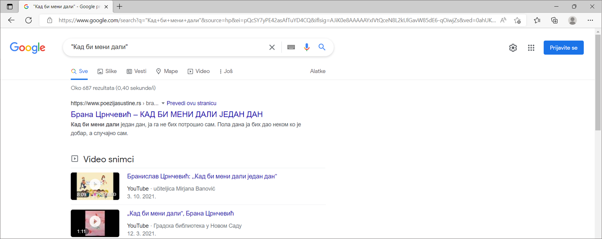
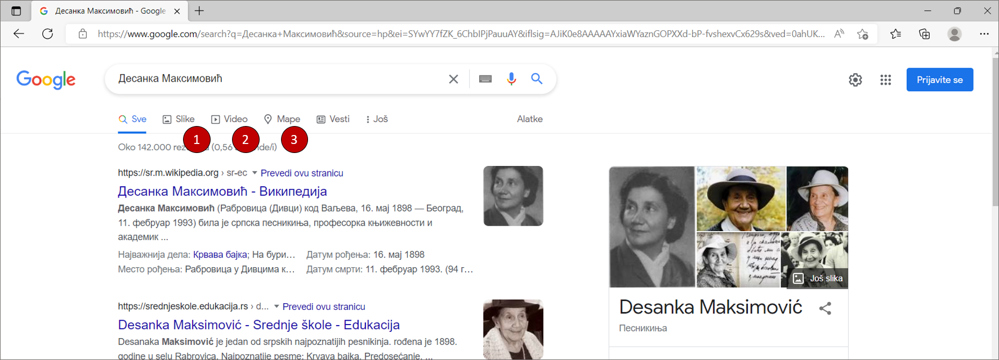

Како претраживати
=================

Како би се на интернету пронашла жељена ствар треба паметно да изабереш које ћеш речи унети у претраживач. 
За почетак са радне површине свог рачунара мораш покренути веб прегледач (у овом случају Мајкрософт Еџ):

.. image:: ../../_images/pi_3.png
   :width: 780
   :align: center

Након тога у прегледачу унеси адресу претраживача. Ако, на пример, унесеш адресу `www.google.com` приказаће ти се нешто попут:

.. image:: ../../_images/pi_4.png
   :width: 780
   :align: center

.. |win| image:: ../../_images/windows.png
            :width: 20px

Уколико се деси да прегледач није на радној површини кликнеш ознаку |win| у левом доњем делу екрана. 
Када ти се отвори листа програма у њој можеш пронаћи жељени прегледач (сети се упутства када се Ворд не налази на 
радној површини).

Наредни корак је да у интернет претраживач, у овом случају Гугл, унесеш оно што желиш да пронађеш, на пример, занима 
те да пронађеш што више o Јовану Цвијићу, откуцаћеш његово име и презиме у простору намењеном за то:

   
Када притиснеш тастер Eнтер добићеш резултате, на основу којих можеш у неколико корака, наћи оно што те занима, 
али више о томе научићеш ускоро! 

.. image:: ../../_images/pi_8.png
   :width: 780
   :align: center

Као што видиш на јако једноставан начин, у неколико корака, можеш пронаћи на вебу оно што те занима! 

Кључне речи
-----------

Кључне речи су оне речи које укуцавамо у претраживач. Ове речи треба да одаберемо тако да на најлакши начин 
објаснимо претраживачу шта желимо да пронађе за нас. Након што укуцамо жељене кључне речи у претраживач и притиснемо 
на тастер Ентер, прегледач нам приказује све резултате наше претраге.
Веома је важно да кључне речи буду прецизне и да дају јасан захтев шта нам је заправо потребно на интернету. 
Уколико, рецимо, из српског учиш о придевима и желиш да сазнаш што више о њима и да нађеш различите примере шта ћеш унети у претраживач?
Ако унесеш кључну реч *Придеви* добићеш велики број информација.
Имајући у виду да су претраживачи напредовали временом кључну реч слободно можеш унети и ћирилицом.

Задатак 1
=========

Покрени прегледач и уколико ти није отворен претраживач покрени Гугл по упутству од малочас. Затим, напиши у 
претраживачу назив своје омиљене животиње. Пронађи и откуцај у Ворду најважније информације о њој.

Пример 1
--------

Замисли да си имаш задатак да помоћу интернета истражиш што више о својој школи. Идеш у Основну школу „Вук Караџић“ 
у Београду и знаш да твоја школа има детаљан сајт. Ако укуцаш Вук Караџић изаћи ће следеће:

.. image:: ../../_images/pi_9.png
   :width: 780
   :align: center

.. questionnote::
 
 Шта мислиш због чега?
 
Сигурно знаш да је Вук Караџић веома важна историјска личност наше земље и на интернету ће у претрази прво изаћи 
списак страница на којима се налазе подаци који су у вези са његовим животом и радом.

Сада замисли да откуцаш Основна школа „Вук Караџић“ Београд и интернет презентација школе се појавила одмах на првом 
месту. 

.. questionnote::
 
 Шта мислиш због чега?

.. infonote::
 
 Управо је то циљ кључних речи. Да се укуца тачно оно што ти треба и тиме уштеди време и добију тачно жељени подаци. 
 То не морају бити комплетне реченице, већ само издвојене речи које ће ти помоћи у проналажењу жељеног материјала!

Пример 2
--------

Твој друг из одељења Никола Петровић освојио је прво место на републичком такмичењу из математике. Знаш да су новине писале о томе. 
У претраживач је унето само Никола и изашло је следеће:

.. image:: ../../_images/pi_11.png
   :width: 780
   :align: center
   
.. questionnote::
 
 Шта мислиш због чега?

 Шта мислиш због чега чланак није изашао одмах?
 
 Шта је требало да укуцаш како би лакше нашао чланак?
 
Корисна правила!
----------------
	
Већ смо напоменули да је вештина уношења кључних речи важна. Међутим, може се десити да чак и када их унесеш, не 
пронађеш одмах оно што ти заиста треба. Постоје правила који ти могу бити од помоћи. Уношењем одређених симбола у 
претраживач себи можеш додатно олакшати посао. Неки од њих су:

Стављање наводника
~~~~~~~~~~~~~~~~~~

Када кључне речи у претраживачу ставиш између наводника, дајеш инструкцију да тражиш дословно те речи по редоследу 
којим си их укуцао.

Стављање звездице (*)
~~~~~~~~~~~~~~~~~~~~~

Стављањем овог знака мењаш било који симбол или реч, нешто попут џокера у картама који мења било који знак. Можеш га искористити 
када не можеш да се сетиш целог назива онога што заправо тражиш. На пример, чуо си бајку „Принцеза на зрну грашка“ и желиш 
поново да је прочиташ, али си заборавио тачан назив. Довољно је да укуцаш „Принцеза на * грашка” и бајка Ханса Кристијана 
Андерсена ти је надохват руке.

.. image:: ../../_images/pi_14.png
   :width: 780
   :align: center
   
Стављање знака „минус“ (-)
~~~~~~~~~~~~~~~~~~~~~~~~~~

До сада си сигурно читао/ла неку песму нашег чувеног песника за децу Јована Јовановића Змаја. Међутим, желиш да ти Гугл да 
резултате претраге само за име и презиме Јован Јовановић, а да не укључује надимак нашег песника, то можеш урадити тако што 
ћеш пре његовог надимка ставити знак „минус“. То ти је слично као и у математици када, ставиш знак минус аутоматски нешто 
одузимаш.  Када то урадиш резултати ће изгледати овако:

.. image:: ../../_images/pi_15.png
   :width: 780
   :align: center

Некада на интернету желимо да пронађемо само слику, видео-запис или мапу одређеног појма. Ово можемо урадити врло лако. 
Најпре, укуцаћемо појам који претражујемо у претраживач. Као што можете видети на примеру испод, као резултат претраге добили 
смо доста информација. Наша идеја је да ”сузимо” избор претраге. То можемо урадити кликом на дугме ”Слике”, ”Видео” или ”Мапе”. 
Уколико кликнемо на дугме ”Слике” приказаће нам се само слике у вези са појмом који смо откуцали у претраживачу.

Пример 3
--------

Као што видиш изнад уколико у претраживачу укуцаш име наше познате књижевнице можеш кликом дати „команду“ Гуглу ако ти је потребна слика, видео-запис или нешто треће.
Ако кликнеш на „Слике“ изаћи ће ти слике које имају везе са овом темом:

   
Уколико ипак желиш да погледаш видео-запис који има везе са њом притиснућеш „Видео“ и појавиће се записи који имају везе са њеним животом и делом:   

.. image:: ../../_images/pi_20.png
   :width: 700
   :align: center
   
Још једна корисна ствар везана за интернет је и та што, помоћу њега брзо и лако можеш добити тачна упутства како се стиже до одређене адресе, било пешака или неким другим превозним 
средством: 

   
Тако да, уколико укуцаш појам Десанка Максимовић и кликнеш на „Мапе“ добићеш списак свих локација које су повезани са њеним 
именом и презименом. Кликом на одређену добићеш упуте како да на најбржи начин стигнеш до неке:

Задатак 2
---------

Изабери један град (то може бити град који си посетио/ла или неки други). Након тога пронађи неку фотографију тог града 
која је по твом мишљењу најлепша и преузми је. Научи друга или другарицу како могу да преузимају фотографије са интернета.

Задатак 3
---------

Уз помоћ интернета пронађи што више информација о својој школи. Најважније и најзанимљивије податке можеш да напишеш или 
откуцаш за школски или одељењски пано.

Задатак 4
---------

Договори се са другом или другарицом да на интернету пронађете основне податке о вашем омиљеном спортисти, глумцу, музичару… 
Те податке, као у претходном задатку, можете или откуцати или написати. Упоредите радове и разговарајте о томе на који начин сте нашли податке, колико вам је времена требало, да ли сте имали неке потешкоће, итд.

Задатак 5
---------

Осмисли један појам (може бити предмет, позната личност, град/држава и слично). Запиши на папир што више кључних речи помоћу 
којих би могао на интернету да пронађеш тај појам брзо и лако. Затим их једну по једну куцај у претраживач. Размисли која је била најуспешнија и због чега.

Задатак 6
---------

Кључне речи не користимо само у дигиталном свету. Сигурно си до сада видео у неким уџбеницима да на крају лекција стоје 
кључне речи. Оне ти помажу да помоћу њих лакше препричаш лекцију. 

Твој задатак је да запишеш кључне речи из ове лекције и да је усмено препричаш или откуцаш у Ворду.

Задатак 7
---------

Слично горенаведеном примеру твој задатак је даш наредбу претраживачу да куцањем појма Биљни и животињски свет Србије добијеш резултате претраге по баш том редоследу речи.

Задатак 8
---------

Помоћу Гугл мапа (Google maps) које је обезбедио Гугл у свом претраживачу пронађи најближи пут пешака (или колима, ако не живиш баш близу) од школе до куће? 

Да ли и ти користиш баш тај пут?

Слободно се ослони на помоћ неког одраслог за овај задатак!

Задатак 9
---------

Преузми са интернета неколико фотографија твоје омиљене познате личности. Не заборави да у ову сврху можеш користити опцију ”Слике” како би ти прегледач приказао само фотографије твоје омиљене познате личности. Убаци их у нови фолдер који ћеш назвати њеним именом и презименом. На тај начин увек могу да ти буду на дохват руке!

Задатак 10
----------

Као што смо рекли на интернету, сем информација и вести, можеш пронаћи и фотографије, видео-записе и други материјал који ти 
може бити користан за учење и продубљивање знања. Пронађи на интернету што више информација о школи у коју идеш 
(адреса на којој се налази, када је саграђена, колико има ученика, шта све има од просторија и материјала...) и то укуцај у 
Ворду. 

Након тога изабери фотографије школе за које мислиш да су најлепше. То све можеш да ископираш и залепиш на хамер који ће 
красити твоју учионицу или школски хол.

.. suggestionnote::

 Претрага интернета преко кључних речи је нешто за шта је потребно и одређено искуство. Немој се разочарати ако одмах, из прве, не пронађеш оно што ти је заиста потребно. Увек размисли још једном и пробај да укуцаш неке друге кључне речи. Временом ћеш бити све успешнији!

Провери своје знање
===================

**Питање 1:**

Интернет прегледач и претраживач су неопходни за рад рачунара?

а) Тачно

**б) Нетачно**

|

**Питање 2:**

Бројевима од 1-5 означи тачан редослед како можеш на интернету пронаћи оно што тражиш:

Покретање прегледача                       ___

Уношење кључних речи                       ___

Укључивање рачунара                        ___ 

Покретање претраживача                     ___

Одабир прегледача (ако их је више)         ___

|

**Питање 3:**   

Међу понуђеним појмовима означи интернет прегледаче:

Мозила Фајерфокс                            

Гугл Хром                                              

Бинг                                                         

Гугл

|

**Питање 4:**

Кључне речи су неопходне како бисмо на интернету нашли нешто?

а) Тачно

**б) Зависи како их и којим редом унесеш.**

в) Нетачно

|

**Питање 5:**

Што јасније напишемо шта тражимо на интернету, брже ћемо пронаћи жељене резултате? (означи одговоре који **нису** тачни). 

а) Тачно

**б) Нетачно**

в**) Зависи од доба дана (ујутру на интернету има мање људи).**

г) Све зависи којим редоследом их напишемо.

д) Лакше ћемо их наћи ако правилно унесемо кључне речи.

|

**Питање 6:**

Повежи симболе са њиховом улогом у претраживачу

„“                        Изостављање одређеног дела из кључних речи.
 
*                          Добијање резултата претраге по одређеном редоследу.

-                           Замена одређеног појма, који стављаш када не можеш да се сетиш одређеног појма.
                        
|

**Питање 7:**

Да ли се реч тенис може сматрати добром кључном речју? Образложи свој одговор

а) Да

б) Не

**в) Све зависи од тога шта тражиш на интернету.**

|

Резултати интернет претраге
===========================

Замисли ситуацију да питаш две различите особе једно исто питање, а да добијеш два потпуно различита одговора. 
Пошто заиста не знаш коме да верујеш, можда би питао још некога? 

Иста ситуација је и на интернету. Не мора да значи да је све оно што прочиташ тамо истина. Већ смо рекли да, на пример, 
неки чланак или информацију на интернету може да напише било ко, тако да шта год желимо да проверимо или научимо на 
интернету морамо да проверимо на више места (извора). 
Због тога је веома важно да интернет садржајима приђеш критички, а то значи да увек провериш тачност информација, 
порекло, када је она објављена (можда се, у међувремену, нешто мењало или постоје нека нова сазнања).

Задатак 1
---------

.. image:: ../../_images/pi_23.png
   :width: 700
   :align: center

Пример 1
~~~~~~~~

  
Можда је вест из прошлог задатка заиста тачна, али је објављена пре неког извесног времена, али ти се појавила међу првима. 
Из тог разлога резултате претраге можеш “филтрирати” по датуму објаве у неколико лаких корака.

.. image:: ../../_images/pi_25.png
   :width: 700
   :align: center
   
Када ти изађу резултати претраге у горњем десном углу изабереш опцију “Алатке”, након тога изабери опцију “Било када”  

.. image:: ../../_images/pi_26.png
   :width: 700
   :align: center

 
И затим можеш резултате претраге “филтрирати” по томе када је нешто постављено на интернет
 

   
.. image:: ../../_images/pi_30.png
   :align: center
 
Задатак
-------

.. questionnote::

 Распитај се код старијих људи из свог окружења на који начин су тражили информације пре појаве интернета. 
 
 Шта су радили када је требало да напишу рад о неком познатом научнику?
 
 Шта мислиш о томе, да ли им је тада било лакше или теже него у данашње време?
 
.. learnmorenote::

 Енциклопедија је дело у коме се, углавном по азбучном, односно абецедном реду, обрађују одређене појаве или појмови. Постоје опште енциклопедије које обрађују све појмове, затим енциклопедије које обухватају одређене области, дечје енциклопедије,  и тако даље.
 Развојем технологије и на интернету су доступне броје енциклопедије различитих аутора.

На интернету постоје енциклопедије које свако, па чак и ти можеш да уредиш. То заправо значи да можеш да напишеш 
чланак у коме ћеш себе представити као врсног фудбалера или успешну балерину.

.. questionnote::

 Шта мислиш због чега то није добро? Да ли се то разликује од прикривања истине и у правом животу?

.. learnmorenote::

 Као што смо већ закључили, на интернету постоје и проверене и непроверене информације. Неки портали и сајтови се служе и 
 кликбејтом (clickbait). Шта је то заправо? Кликбејт одређену вест представља много занимљивијом него што њен садржај заправо 
 јесте. Људи који пишу такве вести желе да што више корисника ту вести отвoри како би имали више прегледа и самим тим остварили 
 одређену корист. Неки од примера кликбејт наслова су: НЕЋЕТЕ ВЕРОВАТИ КАДА ОВО ПРОЧИТАТЕ!, ДА ЛИ СТЕ ЗНАЛИ ОВО?!, ОВАЈ ТЕКСТ 
 МОРАТЕ ДА ПРОЧИТАТЕ! и слично.

У данашње време рекламе су на сваком кораку. На телевизијском програму, радио-станицама, новинама, али свакако су веома 
заступљене и на интернету.
Често се деси да, када на интернету пустимо неки видео-запис, пре него што он почне прво иде нека реклама.

У електронским медијима су рекламе такође веома заступљене. Наравно, разлог за то је што у данашње време много људи 
из практичних разлога чита електронске медије.

Обрати пажњу на следећу рекламу:

.. image:: ../../_images/pi_31.png
   :width: 700
   :align: center
 
.. questionnote::

 Да ли можеш бити сигуран да ћеш постићи те резултате за пет дана само и због чега?
 
Углавном су интернет рекламе или огласи насловљени као Оглас плаћене рекламе. То практично значи да је нека фирма или човек 
платио да та реклама буде на интернету, али не значи да је тај производ или услуга заиста толико квалитетна. 
Закључићемо још једном да интернет јесте користан, али да не треба веровати свему што тамо прочитамо.

Задатак 3
---------

.. questionnote::

 Да ли би се изненадио/ла?
 
 Како би реаговао/ла и зашто?
 
 Како би посаветовао/ла друге којима се то деси?

Замисли да ти при претраживању неког сајта „искочи“ оваква порука: 

.. image:: ../../_images/pi_26.png
   :width: 700
   :align: center
   
Задатак 4
---------

Осмисли плакат који ће послужити као оглас. То може бити производ који већ постоји, а можеш и да осмислиш свој. Слободно пусти машти на вољу!

Задатак 5
---------

Смисли и откуцај једну вест или репортажу. Већ знаш да је вест или репортажа препричавање одређеног догађаја. 
То може нешто везано за школски турнир, о улепшавању твог омиљеног парка или слично. Битно је да ти буде блиска, 
да има довољно информација (шта се десило, где се десило, када се десило...) 

Можеш користити и фотографије.

Забави и себе и друге!

.. infonote::

 Постоје људи на интернету који на превару желе да стекну информације о теби. То не смеш дозволити, али више о томе ћеш научити у следећим лекцијама.

Провери своје знање
===================

**Питање 1:**

Шта ћеш урадити када ниси сигуран да ли је нека информација на интернету тачна?

а) Повероваћу у њу, јер чим је на интернету мора бити поуздана.

**б) Потражићу још неки извор или мишљење.**

в) Одустаћу од тражења тих информација.

|

**Питање 2:**

Подаци у интернет енциклопедијама углавном нису тачни?

а) Тачно

б) Нетачно

**в) Зависи  од тога да ли је та енциклопедија научно поуздана и на њој раде људи који су познати у одређеној области.**
(Ако си ставио одговор под в, објасни од чега зависи.)

|

**Питање 3:**

Где све имамо приступ електронским медијима (селектуј само један тачан одговор)?

а) Код куће.

б) На улици.

**в) Свуда око нас где постоје одређени медији.**

|

**Питање 4:**

Објасни која је сврха Кликбејта? Означи тачне одговоре.

**а) Да те убеди да купиш нешто преко интернета.**

б) Да ти скрене пажњу да нису све странице на интернету поуздане.

**в) Да те насловом заинтересује да неку вест, видео-запис, оглас или неки други садржај отвориш.**

|

**Питање 5:**

Где се све појављују огласи?

а) У новинама.

б) На интернету.

в) Свуда око нас - на улици, поштанском сандучету...**

**г) Сви одговори су тачни.**

