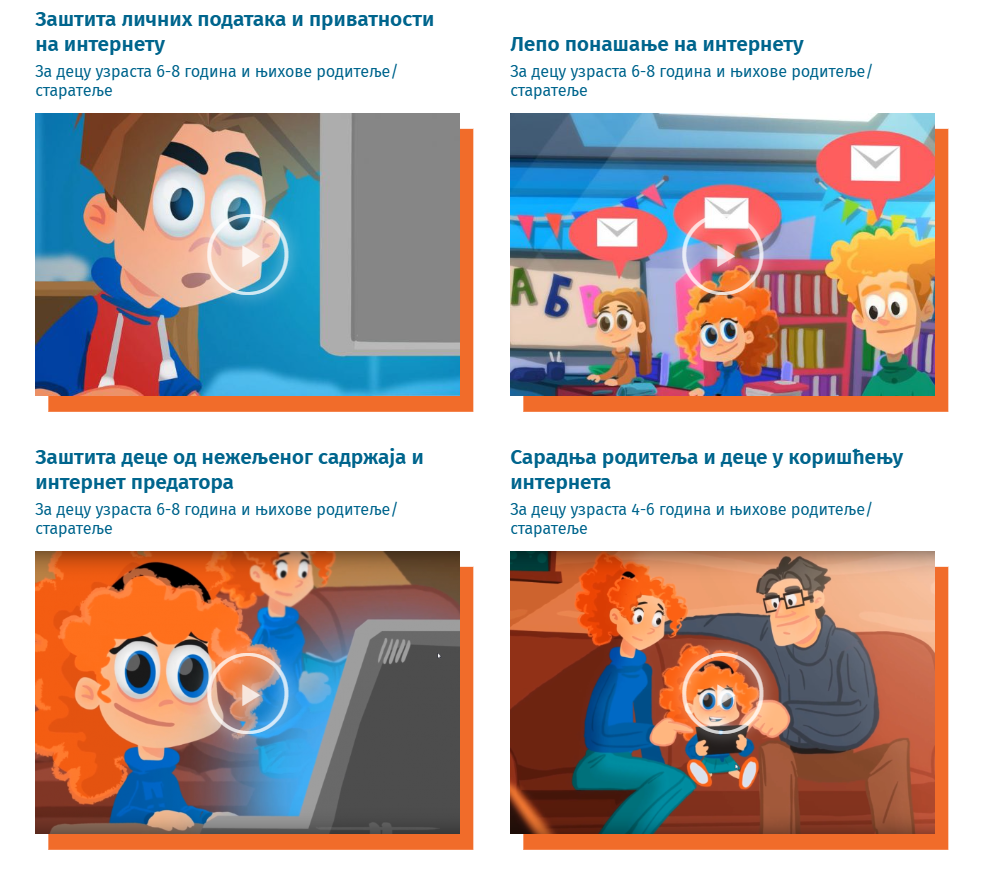

Дигитални углед
===============

Изабери једну **угледну** особу из свог окружења. Због чега си изабрао баш ту особу? Да ли је углед те особе позитиван или негативан?

На који начин је та особа стекла такав углед? Да ли сви у окружењу имају исто мишљење као ти?

.. questionnote::
 Шта је то углед?

Слика коју други имају о теби највише зависи од тебе самог - твог понашања, реаговања у одређеним ситуацијама, 
начина на који се представљаш и информација које о себи делиш. 

Управо ова слика представља твој **углед**.

.. questionnote::

 Осим у реалном животу, углед се гради и у дигиталном свету. На основу чега други креирају мишљење о нама на интернету? Шта све утиче на твој дигитални углед?

Сваки корисник интернета има свој **дигитални углед**. Дигитални углед се гради на основу: 

- садржаја твојих порука (на пример, у Вајбер групи) и начина на који их пишеш, 
- фотографија и видео-записа које делиш, 
- онога што „лајкујеш”, 
- видео-игрица које играш, 
- група у које си укључен, 
- веб-сајтова које посећујеш,
- ...

Дељењем информација на интернету, остављаш **дигиталне трагове** који се тешко могу обрисати. Оно што поделиш на 
интернету доступно је великом броју особа (познатих и непознатих). 
Када једном нешто поделиш, губиш контролу над тим (неко може то да сачува и касније злоупотреби). 

.. questionnote::

 Шта су дигитални трагови?

Дигитални трагови су информације и подаци које остављаш за собом док користиш интернет. 
Kада се пријавиш на друштвене мреже, шаљеш поруке, коментаришеш слике, претражујеш интернет или 
купујеш ствари онлајн, свака од ових активности оставља неки траг. Ти трагови могу бити текст, 
слике, видео-записи...

|

Дигитални трагови играју важну улогу. Они могу да оставе трајан утисак о томе ко си и како се понашаш у дигиталном 
свету. До њих ће, уз мало труда, лако доћи и твоји пријатељи, чланови породице, другарице и другари из школе и (кроз неколико година) они са 
којима ћеш можда желети да радиш. 

Због тога, 

.. infonote::

 пре него што било шта (о себи или другима) поделиш или објавиш на интернету, 
 важно да застанеш и размислиш...

 - због чега то објављујеш? 
 - ко ће то моћи да види (вршњаци, родитељи, наставница)?
 - како ће то утицати на мишљење других о теби? 
 - да ли тиме што објављујеш или шаљеш можеш некога да повредиш?
 - како ће се осећати особе на које се то односи,
 - ...

.. infonote::
 
 **О свом дигиталном угледу водиш рачуна и тако што не објављујеш ништа у тренуцима када си љут, бесан или тужан.** 

Ево неколико савета који ће ти помоћи да очуваш свој дигитални углед:

|

- **Добро размисли пре него што нешто поделиш на интернету**!

Пре него што нешто поставиш на интернет, запитај се да ли је то нешто што стварно желиш да други виде. Ако ниси сигуран, боље је да се суздржиш.

|

- **Пажљиво коментариши!** 

Ако остављаш коментаре испод слика или видео-садржаја, буди љубазан и поштуј друге људе. Злонамерни коментари могу да повреде друге и негативно утичу на твој углед.

|

- **Немој да делиш личне информације!** 
 
Никада немој да делиш своје личне информације - адресу, број телефона или назив школе у коју идеш. То може бити опасно, јер не знаш ко све може да види те информације и употреби их на непримерен начин.

|

- **Лозинке су важне.** 

Ако користиш платформе за учење или играње игрица, друштвене мреже, користи јаке лозинке и немој да их делиш ни са ким. Сигурно не би било пријатно да приметиш да је неко нешто написао у твоје име.

|

- **На интернету треба да се понашаш као и у стварном животу.** 

Твоје понашање на интернету требало би да буде слично оном у стварном животу. Буди добар пријатељ и корисник и на мрежама. Комуницирај са особама као што би то радио лицем у лице.

|

- **Разговарај са родитељима или старатељима.** 

Ако наиђеш на нешто што те узнемирава или не знаш шта да радиш у одређеним ситуацијама, обавезно се обрати својим родитељима или старатељима. Они ће ти помоћи и заштитити те.

|

- **Научи како да промениш поставке приватности.** 

Већина платформи ти омогућава да подесиш ко може да види оно што објављујеш. Распитај се како да поставиш приватност тако да само људи које познајеш могу да виде оно што постављаш. Иако, буди и даље опрезан, 
јер и тада постоји могућност да твоји садржаји дођу и до оних за које ниси очекивао.

|

.. infonote::

 Иако ти се у овом тренутку вероватно не чини да је тако, све што радиш на интернету може имати утицај на твоју будућност!

.. questionnote::

 Ко су инфлуенсери? Да ли пратиш неког јутјубера? Какав садржај дели? Да ли ове особе увек имају позитиван дигитални углед?

Пажљиво погледај следеће видео-записе:

|

(https://digitalni-vodic.ucpd.rs/crtani-filmovi/)

-----------

На крају области о безбедном коришћењу дигиталних уређаја очекују те и питања у вези њиховог садржаја!

.. questionnote::

 На часу Ликовног васпитања направи са другарима постер о лепом понашању на интернету.

