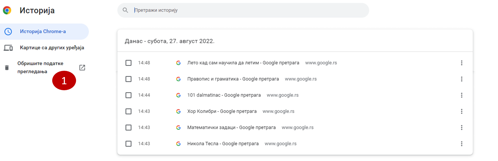

Дигитални углед
===============

Вероватно си до сада чуо када се за неку особу каже да је угледна. То значи да је успешна и поштована. Углед се не стиче преко ноћи већ 
се на њему марљиво ради. 

Циљ ове лекције је да научиш на који начин можеш да изградиш и очуваш свој дигитални углед.

Да ли и ти знаш неку угледну особу из своје околине? Опиши по чему је она угледна и наброј све њене позитивне особине. 

Сигурно знаш за неки филм где детектив помоћу одређених трагова реши случај или када пас трагач нањуши трагове и нешто значајно открије. 

Када ходаш по снегу, за тобом остају трагови, али ти трагови временом нестану. Међутим све оно што постављаш на интернет остаје заувек 
забележено. Не дозволи себи да људи на основу тога стекну погрешну слику о теби. 

То ћеш сигурно спречити уколико поштујеш следеће савете: 

- Постављај само материјале прилагођене твом узрасту и интересовањима.
- Пази на правопис, људи ће те много озбиљније схватити ако се изражаваш правилно.
- Уколико коментаришеш нечију објаву, користи прикладан речник.
- У комуникацији са одраслима обраћај им се са поштовањем.

Задатак 1
---------

Прочитај следећи текст, добро размисли и дај одговор.

Јован и Мирослав су ученици трећег разреда и веома воле кошарку. На часовима физичког уживају убацивајући лопту у кош. 
У слободно време Јован на интернет често поставља како вредно тренира, као и фотографије својих кошаркашких идола. 
Мирослав је веома успешан у игрању рачунарских игрица и већи део дана проводи играјући их. На интернету се често хвали 
својим успесима, док праву кошарку и не спомиње.

Кошаркашки клуб који ускоро почиње са радом тражи будуће кошаркаше који би почели да тренирају. На позив се јавило 
много добрих играча, а међу њима и Јован и Мирослав. Места нема за све и тренер је након разговора одлучио да на 
интернету потражи податке о њима. Када је погледао њихове објаве, одлучио се само за једног од њих двојице.

.. questionnote::

 Шта мислиш за кога и због чега?
 
Дигитални трагови
=================

Дигитални трагови представљају све оне информације које остављамо на интернету. У то спадају поруке, фотографије, 
цртежи, видео-записи, објаве на друштвеним мрежама, и тако даље. 

Провајдери интернет услуга бележе када си садржају приступио, а власници интернет сервиса шта си помоћу њиховог сервиса 
радио. То значи да ако си другу или другарици на Вибер послао поруку омиљене играчке у 10:15, а приступио си интернету 
у 10:10, провајдер је забележио да си се у 10:10 пријавио на интернет, а власник интернет сервиса да си на том сервису 
(у овом случају Виберу) у 10:15 послао/послала фотографију играчке. Уколико више пута шаљеш фотографије играчака може 
се десити да ти се на Виберу често буде појављивала нека од продавница играчака. Дакле, резултати претраге и ствари 
које шаљемо остају забележене чак и када их обришемо.

Како твој дигитални траг не би нарушио твој углед, придржавај се следећих савета:

- Размисли пре него што поставиш своју објаву  на интернет. Нешто што ти је сада симпатично можда касније неће бити.
- Запамти да ако и обришеш нешто, то не значи да је заувек нестало са интернета.
- Оно што објавиш се може ширити великом брзином.

Анализирајући твоје дигиталне трагове људи стичу мишљење о теби.

.. suggestionnote::

 Пред тобом се налази упутство како можеш да погледаш и обришеш историју претраге са свог рачунара. 
 Добро погледај упутство и пређи на следећи задатак.
 
Како би отворио/ла историју прегледа  потребно је да покренеш прегледач и затим истовремено притиснеш дугме ,,Ctrl“ и 
дугме ,,H“

Када ти се отвори историја прегледа, кликнеш на опцију са леве стране ,,Обришите податке прегледања“.

На тај начин отвараш нови прозор на коме добијаш избор шта желиш да обришеш и за који период желиш да обришеш претрагу. 
Кликом на опцију ,,Обриши податке прегледања“ и остављањем опције у падајућем менију ,,Одувек“  бришеш све податке интернет претраге.

На тај начин отвараш нови прозор на коме добијаш избор шта желиш да обришеш и за који период желиш да обришеш претрагу. 
Кликом на опцију ,,Обриши податке прегледања“ и остављањем опције у падајућем менију ,,Одувек“  бришеш све податке 
интернет претраге.

Задатак 2
--------- 

Када будеш користио интернет следећи пут, било то гледање видео-записа, играње игрица или тражење неких информација, 
прегледај своје дигиталне трагове. Као што смо већ рекли у њих спадају и слике, коментари, видео-записи, текстови 
које постављаш. Добро размисли има ли међу њима неких неприкладних. Направи себи постер или плакат који ћеш држати 
поред рачунара. На њему можеш да укратко испишеш све предности остављања позитивних дигиталних трагова

.. questionnote::

 Да ли можеш да набројиш неке негативне дигиталне трагове?
  
.. infonote::

 Уколико ти се ипак деси да на интернет поставиш неку објаву, коментар, видео-запис, фотографију или било шта што може 
 да наруши твој дигитални траг јако је важно да знаш да сви ми некада грешимо. Труди се да од тада постављаш само 
 примерене ствари и људи ће сигурно увидети да су тај један или два непримерена дигитална трага нешто што заиста не 
 представља какав си ти заиста.

Да ли знаш да?
~~~~~~~~~~~~~~

Људи који су у потрази за послом своју радну биографију могу да поставе на интернет како би лакше дошли до посла. 
Она садржи основне податке (име, презиме, годину рођења, контакт телефон...), информације о образовању, вештинама, 
интересовањима и прикладну фотографију. 

.. suggestionnote::

 Међутим, послодавци веома лако и путем интернета могу да сазнају о кандидату доста тога уколико истраже 
 његове дигиталне трагове. 
 

 
.. suggestionnote::

Да си ти послодавац како би одлучио/ла да ли ћеш некога да запослиш или не?

Задатак 3
---------

Провери своје знањe
~~~~~~~~~~~~~~~~~~~

**Питање 1:**

Објаве на друштвеним мрежама спадају у дигиталне трагове?

**а) Тачно**

б) Нетачно

|

**Питање 2:**

Ако си у ситуацији да бираш фотографију која ће се налазити у твојој биографији, каква би то фотографија била? (Образложи свој одговор.)

а) Фотографија са другарима са мора.

б) Фотографија на којој правиш гримасе са другом или другарицом из клупе.

**в) Фотографија на којој ти се јасно види лице, а иза тебе је светла позадина.**

|

**Питање 3:**

Како би некоме ко тек почиње да користи интернет објаснио због чега је важан дигитални углед? Означи тачне одговор/е.

**а) Битно је да људи по твојим дигиталним траговима не стекну погрешно мишљење о теби.**

б) Добијаћеш већи џепарац од родитеља уколико барем једном дневно слушаш песме о мами и тати.

в) Уколико су твоји дигитални трагови из периода кад си био дете примерени сигурно ћеш кад порастеш радити посао који желиш. 

г) Сви одговори су тачни.

д) Ниједан одговор није тачан.

