Усклађеност дигиталних садржаја са узрастом корисника
=====================================================

			
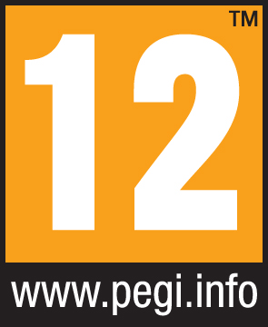
			

			
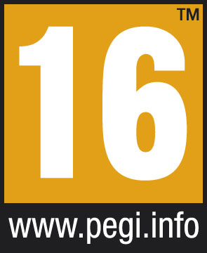
			
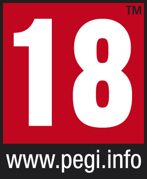
			
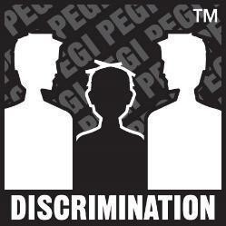
			
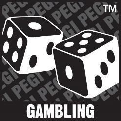

			
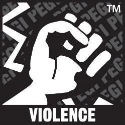
			
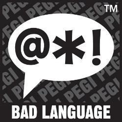
			
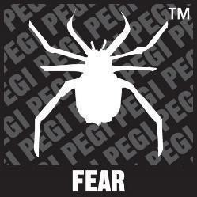
			
.. questionnote::

 - Коју видео-игру најчешће играш? А твоји другари и другарице? 
 
 - О чему се ради у игри коју волиш? Да ли је, по твом мишљењу, намењена деци твог узраста? 
 
 -  Постоји ли нешто у тој игри што мислиш да није за твоје вршњаке?
 

Видео-игре често садрже елементе који нису препоручени за сваки узраст. Осим по тежини, игре се разликују и по 
томе ком узрасту играча су намењене. 

.. questionnote::

 Да ли си, тражећи игрицу на интернету, некад наишао на овaкве или сличне ознаке?

 |12f| 

 Да ли знаш чему оне служе?

У питању су **ПЕГИ** ознаке. Као што на ТВ-екрану можеш да видиш број у горњем десном углу који показује колико најмање година треба да има особа 
која гледа емисију или филм који се приказује, тако у свету видео-игара на сајту игре коју користиш можеш да пронађеш 
овакве или сличне ознаке.

.. learnmorenote::

 **Шта значи ПЕГИ?**

 **ПЕГИ** (енг. *Pan-European Game Information*) је систем помоћу којег се процењује за који је узраст примерена 
 одређена видео-игра. Овај систем установила је Европска комисија још 2003. године и данас се користи у близу 40 
 европских земаља, укључујући и Србију. 

Често се мисли да ПЕГИ ознака говори колико је игра компликована и сложена. То је погрешно. Ознака са бројем указује на најмањи број година детета или особе за коју је игра прилагођена. 

Друга слика упозорава који се све непримерени елементи могу појавити у игрици. На пример: неприкладан говор, застрашујући звуци и слично. Наравно, то не значи да неко са 18 година не може да игра игру са ознаком 12.

.. questionnote::

 ПЕГИ ознаке приказане су у табели испод. Разговарај са учитељем или родитељима о значењу сваке од њих!

.. csv-table:: 
   :header: "**ПЕГИ ОЗНАКА**", "**ЗНАЧЕЊЕ**"
   :widths: auto
   :align: left
   
   "|3|", "Садржај игара са оценом ПЕГИ 3 сматра се погодним за све старосне групе. Игра не би требало да садржи звуке или слике који би могли уплашити млађу децу. Прихватљив је врло благи облик „насилног“ понашања (оног које је у служби шале или се посматра као део дечије игре). Не треба да постоје неприкладни термини.",   
   "|7|", "ПЕГИ 7 је ознака за игре са сценама или звуцима који би могли застрашити млађу децу. У овим видео-играма могу да се јаве врло благи облици насиља (имплицитно, неописиво или нереално насиље). "              
   "|12|", "Видео-игре које приказују насиље мало сликовитије природе према фантастичним ликовима или нереално насиље према ликовима сличним људима спадају у ову старосну категорију. Сваки неприкладан говор у овој категорији мора бити умерен."
   "|16|", "Ова оцена се примењује када приказ насиља достигне фазу која изгледа исто као што би се очекивало у стварном животу. Употреба неприкладног језика у играма са оценом ПЕГИ 16 може бити екстремнија, а може се јавити и употреба дувана, алкохола или илегалних дрога. "
   "|18|", "У овим играма могу да се јаве прикази грубог насиља, убијања без мотива или насиља према беспомоћним ликовима. Могу се појавити и конзумирање илегалних дрога, симулације коцкања и разне активности које нису примерене деци."	

.. csv-table:: 
   :widths: auto
   :align: left
   
   "|nasilje|", "Игра садржи приказе насиља. У играма са оценом ПЕГИ 7 ово може да буде само нереално или насиље без детаља. У играма са оценом ПЕГИ 12 може да се јави насиље у фантастичном окружењу или нереално насиље над ликовима сличним људима, док игре оцењене са ПЕГИ 16 или 18 имају реалистичнији приказ насиља."	
   "|ruzne_reci|","Игра садржи неприкладан говор. На ову ознаку можеш да наиђеш у играма са ПЕГИ 12 (благе псовке), или ПЕГИ 16 и ПЕГИ 18 (грубе увреде)." 	
   "|strah|", "Ова ознака се може појавити као „страх“ у играма са ПЕГИ 7 ако садржи слике или звуке који могу бити застрашујући или могу да плаше млађу децу, или као „хорор“ у играма намењеним старијем узрасту.  Овако означене видео-игре могу да садрже умерене (ПЕГИ 12) или интензивније и трајне (ПЕГИ 16) хорор делове или узнемирујуће слике (не нужно укључујући насилни садржај)."	
   "|kocka|","Игра садржи елементе који подстичу или подучавају коцкање. Ове симулације коцкања односе се на игре на срећу које се обично изводе у казинима или коцкарницама. Игре са оваквим садржајем увек су означене са ПЕГИ 18." 	
   "|diskr|", "Игра садржи приказе етничких, верских, националистичких или других стереотипа који би могли да подстакну мржњу. Овај садржај је увек ограничен са ПЕГИ 18 (и вероватно крши државне кривичне законе)."	
   "|kupovina|","Игра нуди играчима могућност куповине дигиталне робе или услуга у стварној валути. Такве куповине укључују додатни садржај (нивои бонуса, одећа, предмети за изненађење, музика), али и надоградње (нпр. за онемогућавање огласа), претплате, виртуелне кованице и друге облике валуте у игри." 	

.. suggestionnote::

 Чак и када играш видео-игру која има ознаку примерену твом узрасту, може да се деси да наиђеш на неке непожељне 
 садржаје. Велики број игара, чак и са ознаком ПЕГИ 3 садржи огласе и могућност трошења новца унутар игре (нпр. 
 прелазак на виши ниво, додатне могућности). 

 Уколико наиђеш на такву игру, обавезно обавести неког одраслог у породици. Увек постоји могућност да пријавиш такву 
 ситуацију и спречиш да се то деси и неком другом детету. На пример, ако је игра преузета из Гугл продавнице, могуће је 
 пријавити неправилност на страници

 https://support.google.com/googleplay/contact/rap_family

Једна од популарних видео-игара која се може користити и у едукативне сврхе јесте **Мајнкрафт** (енг. *Minecraft*). 

Пронађи сајт ове видео-игре и погледај ПЕГИ ознаку. Ком узрасту је примерена ова игра?

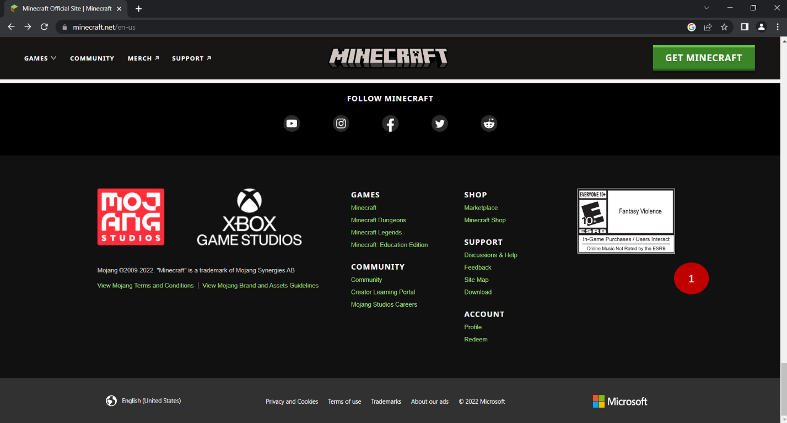

На исти начин можеш да пронађеш и проучиш ПЕГИ ознаке осталих видео-игара за које си чуо или које желиш да играш.

Један од сајтова који ти могу помоћи јесте и https://pegi.info/. Када отвориш овај сајт, на врху странице видећеш 
оквир за текст у који можеш да унесеш назив видео-игре за коју желиш да провериш да ли је одговарајућа за твој узраст. 

Рецимо да је реч о игри *Fortnite*.

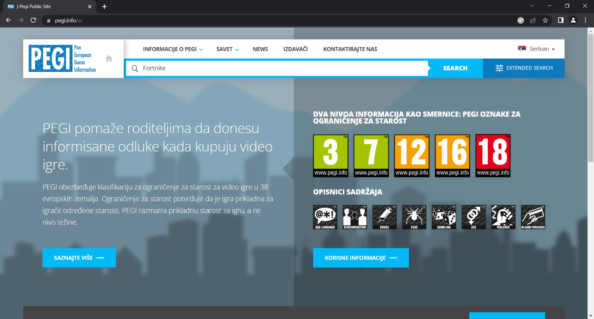

Унеси назив игре и кликни на *Search* (претражи)

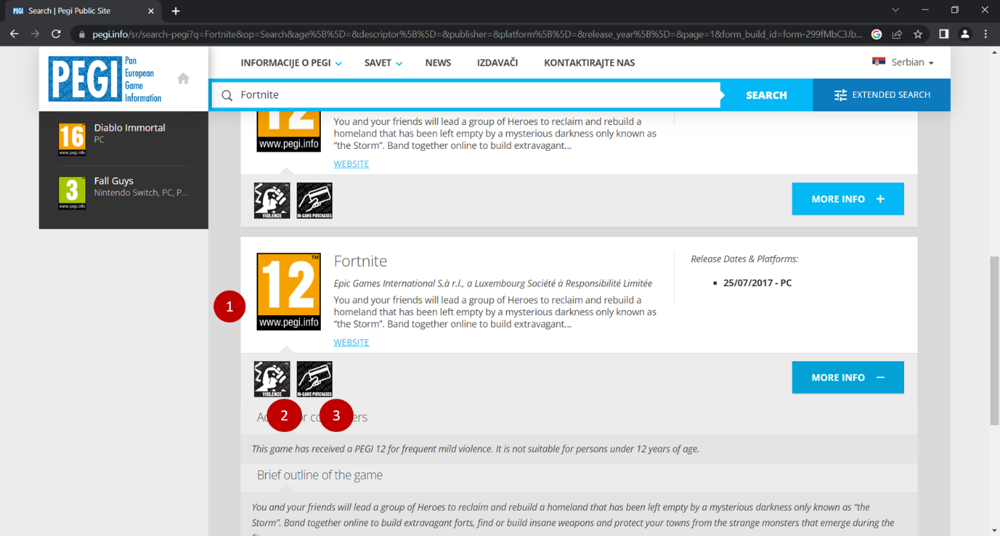

Шта можеш да закључиш из ове ПЕГИ ознаке? Које је значење сличица са ознакама 1, 2 и 3?

.. learnmorenote::

 **Више о примерености дигиталних садржаја узрасту**

 Ако те је заинтересовала ова тема, више информација можеш да пронађеш на следећим страницама:

 http://ucpd.rs/dokumenti/vodic--deca-u-digitalnom-dobu.pdf

 https://digitalni-vodic.ucpd.rs/igranje-video-igara-gejming/

