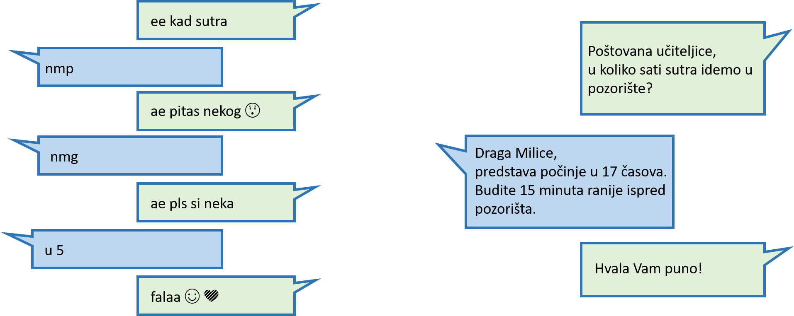

Примерена комуникација у дигиталном окружењу
============================================

Људи све чешће комуницирају преко интернета. Важно је да, већ на самом почетку коришћења дигиталних уређаја, разумеш да је одговорно понашање у дигиталном свету веома важно.

.. questionnote::

 Коју платформу користиш за размену порука са другарицама и друговима? А са родитељима и наставницима?

 Да ли све поруке пишеш на исти начин? По чему се разликују поруке које пишеш другарима од порука упућених некој старијој особи?

Марко сутра треба да иде у позориште, али је заборавио у колико сати. Обратио се Милици.

|

Пажљиво прочитај следеће поруке:  

|

.. questionnote::

 Коме се обратила Милица? По чему се разликује начин на који се дописују Марко и Милица од начина на који то раде Милица и учитељица?

Милица се обратила учитељици за информацију, што је, у овом случају, најбоље решење. Али, да ли је на прави начин и пренела информацију Марку? Да ли ће Марко стићи на време у позориште?

-----------

За размену мишљења везану за оно што се у школи учи, за групне школске задатке, често се користи школска платформа за онлајн учење. Како би се што боље организовали, за договоре и 
комуникацију у вези школе наставници, родитељи и ученици праве и различите групе на некој од платформи за размену порука. 

|

Комуникација у затвореним групама је добро решење зато што неће баш свако моћи да прочита оно што пишеш. Мала је и вероватноћа да ћеш ступити у контакт са непознатом особом. С друге стране, важно је да водиш рачуна да твоје поруке 
разумеју на прави начин сви који могу да их виде.

|

Млађе особе најчешће пишу кратке поруке, скраћенице. Понекад поруку чине само различити емотикони. Нажалост, све чешће се у порукама срећу и грубе, ружне речи.

.. questionnote::

 На шта треба да обратиш пажњу када са неким комуницираш преко интернета?

Без обзира да ли комуницираш са другарима или са неком старијом особом, води рачуна о следећем:

.. infonote::

 - Поштуј граматичка правила, како би твоје поруке биле јасне и разумљиве.
 - Труди се да поштујеш правила дигиталног правописа (води рачуна о начину на који користиш размаке).
 - Увек буди љубазан, баш као и у стварном животу. 
 - Немој да користиш ружне речи или псовке.
 - Пре него што нешто напишеш или кажеш, размисли како би то могло да утиче на друге особе. Води рачуна о туђим осећањима.
 - Ако се нађеш у некој проблематичној ситуацији, покушај да је решиш на миран начин. Немој да улазиш у расправе.
 - Немој да делиш информације о другим особама без њихове дозволе.
 - Уважавај различитости и буди отворен за нове идеје.

Ако се дописујеш са наставником или неком другом старијом особом, потруди се да реченице буду јасне, конкретне и потпуне.
Може да се деси да погрешно разумеју емотиконе које користиш, тако да је боље да их избегаваш. Ако треба да пошаљеш 
неку важну поруку најбоље је да то, преко електронске поште, у твоје име ураде родитељи или нека друга одговорна особа.

.. infonote::

 Ако у онлајн окружењу комуницираш на примерен начин, сачуваћеш добре односе са људима, спречићеш различите неспоразуме и **очувати свој дигитални углед**.

 