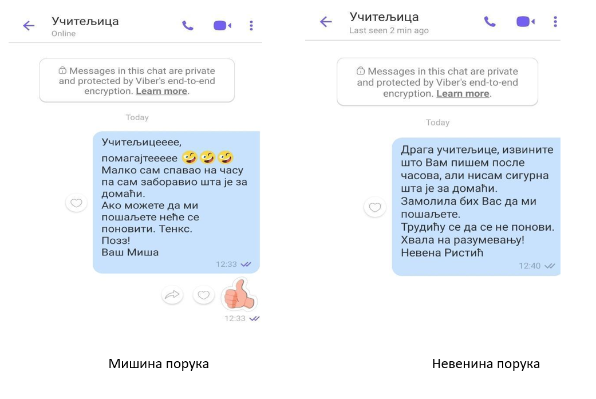

Примерена комуникација у дигиталном окружењу
============================================

Погледај следећи музички спот хора „Чаролија“ који можеш пронаћи на следећем линку:

https://www.youtube.com/watch?v=eUbw25gWQi8

.. questionnote::

 Да ли ти се свидела ова песма и због чега?
 
 О чему говори ова песма?
 
 Због чега је важно да чувамо свој језик?
 
 На које све начине то можемо да урадимо?

Као што смо већ споменули и у писменом и усменом обраћању веома је важна и правилна и учтива комуникација. 

Вероватно си до сада имао прилике да комуницираш са неким користећи дигиталне уређаје. Циљ ове лекције је да научиш 
на који начин ћеш  помоћу интернета оставити добар утисак у комуникацији са старијим особама и вршњацима.

Дечак Миша је заборавио шта је учитељица задала за домаћи. Пошто му то није био први пут хтео је да избегне грдње 
родитеља и сам је учитељици послао поруку. Исти проблем је имала и његова другарица Невена.
 
.. questionnote::

 Добро погледај оба примера и размисли чија порука је прикладнија и због чега. Какав стил писања користи Миша, 
 а какав Невена?
 

Како одрасташ, све више ћеш имати потребу да комуницираш са старијим људима. Сигурно не желиш да се представиш другачијим него 
што јеси и због тога је битно да запамтиш следеће: 

- У комуникацији са старијима мораш им се обраћати са поштовањем.
- Реченице морају бити кратке и јасне.
- Није пожељно стављати емотиконе и писати скраћенице.
- Пази на правопис и правилно користи знаке интерпункције.
- Ако шаљеш фотографије, оне морају бити у вези са темом и садржати објашњење.

.. infonote::

 Друштвене мреже су платформе које окупљају велики број људи. Ту комуницирамо међусобно, објављујемо фотографије, 
 видео-записе и друге електронске материјале и износимо своја мишљења.  
 Оне могу бити корисне, али на њима можеш доћи у комуникацију са неким кога не познајеш. 

 Битно је да знаш да друштвене мреже, као што су Фејсбук или Инстраграм нису предвиђене за млађе од 15 година!

Мобилни телефони, таблети и рачунари нису одувек постојали. Људи су кроз историју комуницирали на различите начине. 
Питај маму, тату, баку и деку како су, када су били мали, контактирали са својим пријатељима кад су желели да се играју. Да ли су им слали СМС поруке или су морали да се мало помуче? 

.. questionnote::

 Размисли и подсети се на који начин нам је развој науке и технике помогао у брзини ширења информација. Због чега је важно да се вести и поруке брзо шире?

Можда си на некој друштвеној платформи, на пример Вајберу, члан неке вршњачке групе (са другарима из одељења, тренинга, школе глуме...). Важно је да знаш да све што пишеш други могу да сачувају, па увек користи пристојан речник и шаљи прикладан садржај.

.. infonote::

 Уколико цео текст куцаш са укљученим великим словима (Caps Lock опција), саговорник може помислити да вичеш на њега тако да то избегавај и не заборављај правилно коришћење знакова интерпункције!

Задатак 1:
----------

Изабери један празник и осмисли поруку да тај празник честиташ свом тренеру или наставнику. Не заборави правила о којима 
смо причали. Можеш откуцати у Ворду или комбиновати текст и слику у Бојанци (*Paint*) као што си већ научио/ла. 
Поруку не шаљеш, она ти служи само као провера наученог из ове лекције.

.. infonote::

 Уколико немаш дозволу од наставника да ти комуницираш са њим, то препусти родитељима.

Задатак 2:
----------

Сада замисли да се јављаш другу или другарици и пишеш поруку са утисцима са школског излета.
У чему се разликује порука коју си писао тренеру/наставнику од поруке другу/другарици?
Да ли си користио/ла исти речник и цртеж/сличицу? Због чега?

ПРОВЕРИ СВОЈЕ ЗНАЊЕ
===================

|

**Питање 1:**

У комуникацији са старијима на друштвеним платформама мораш бити учтив и користити што више скраћеница које си научио у другом разреду?

а) Да 

**б) Не**

|

**Питање 2:**

Реченице морају бити кратке и јасне, а фотографије садржати објашњења када комуницираш са другарима из одељења?

а) Да

**б) Не**

|

**Питање 3:**

Изгубио си број другарице из детињства, а желиш да је позовеш на рођендан. Шта ћеш урадити? Означи тачне одговоре.

**а) Замолићеш родитеље да ступе у контакт са њеним родитељима.**

**б) Када пролазиш поред њене зграде, проверићеш да ли је код куће.**

в) Потражићеш је на Фејсбуку. 

|

**Питање 4:**

Знаш да твоја учитељица много воли животиње и непрестано јој шаљеш на Вибер фотографије кућних љубимаца. Да ли мислиш да је то у реду? Образложи свој одговор.

а) То је у реду јер знам да на позадини рачунара држи фотографије своје куце и маце.

б) Слао бих јој, али само неколико фотографија дневно, иако ми не одговара.

***в) Не бих слао док не будем сигуран да јој то не смета.**

г) Слао бих, али без икаквих емотикона и описа фотографија.

Питање 5:
---------

Стигла ти је порука од непознате особе која те пита како си, где живиш и да ли тренираш неки спорт. На фотографији је млађа коју не препознајеш. Твоја реакција:

а) Одговорићеш примереним речником пошто ту особу не познајеш.

б) Нећеш одговорити и обрисаћеш поруку.

**в) Пријавићеш родитељима.**

**г) Уколико родитељи нису код куће позваћеш 19833 и пријавити случај.**

