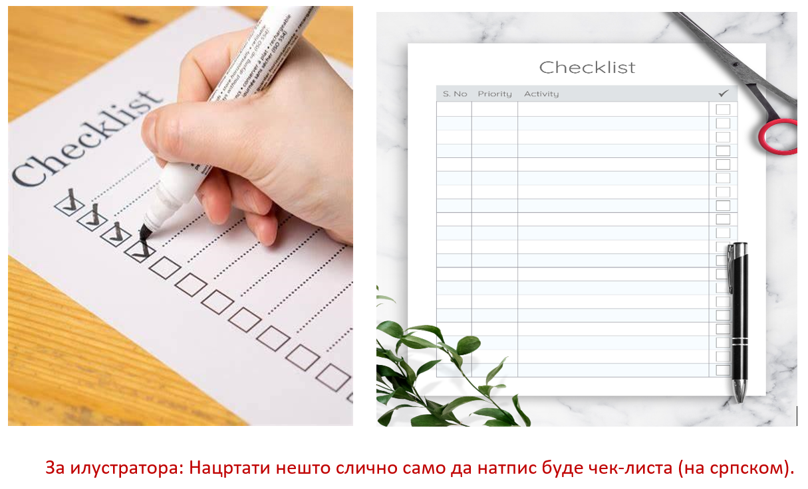

Примерена комуникација у дигиталном окружењу
============================================

Погледај следећи музички спот хора „Чаролија“ који можеш пронаћи на следећем линку:

https://www.youtube.com/watch?v=eUbw25gWQi8

.. questionnote::

 Да ли ти се свидела ова песма и због чега?
 
 О чему говори ова песма?
 
 Због чега је важно да чувамо свој језик?
 
 На које све начине то можемо да урадимо?

Као што смо већ споменули и у писменом и усменом обраћању веома је важна и правилна и учтива комуникација. 

Вероватно си до сада имао прилике да комуницираш са неким користећи дигиталне уређаје. Циљ ове лекције је да научиш 
на који начин ћеш  помоћу интернета оставити добар утисак у комуникацији са старијим особама и вршњацима.

Дечак Миша је заборавио шта је учитељица задала за домаћи. Пошто му то није био први пут хтео је да избегне грдње 
родитеља и сам је учитељици послао поруку. Исти проблем је имала и његова другарица Невена.
 
.. questionnote::

 Добро погледај оба примера и размисли чија порука је прикладнија и због чега. Какав стил писања користи Миша, 
 а какав Невена?
 

