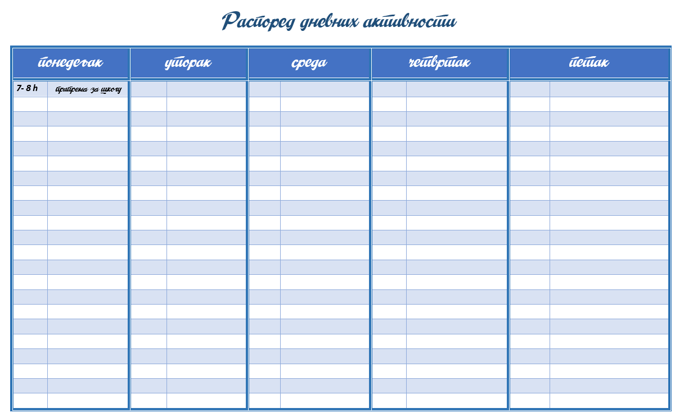
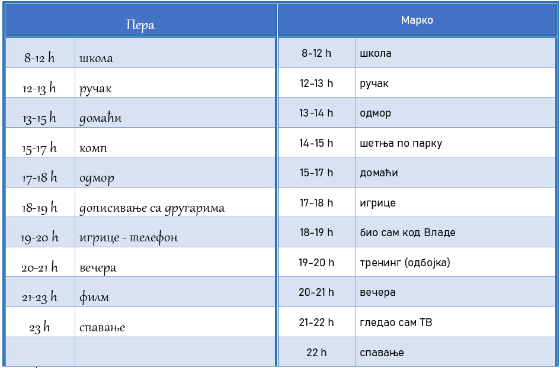

Израда личног плана коришћења дигиталних уређаја
================================================

.. questionnote::

 Присети се јучерашњег дана. Које су биле твоје активности? 
 
Нацртај табелу сличну датој и запиши своје активности. Попуњавај табелу наредних неколико дана, а затим одговори на постављена питања.

.. questionnote::

 Један дан има 24 сата. Колико времена...

 - спаваш?
 - учиш?
 - проводиш играјући се са другарицама и другарима?
 - шеташ или се бавиш спортом?
 - проводиш уз мобилни телефон или неки други дигитални уређај?

Погледај како су Пера и Марко јуче провели дан.

.. questionnote::

 По чему се њихов рапоред разликује од твог? Колико је времена Пера провео користећи дигиталне уређаје, а колико 
 Марко?

Бројна истраживања показују да деца твог узраста проводе пуно времена на интернету и уз мобилне телефоне или 
друге дигиталне уређаје. 

Ако је укупно време које током дана проводиш забављајући се испред екрана дуже од два сата, било би веома пожељно да промениш своје навике!

|

Хајде да видимо шта би могло да се измени у твом дневном распореду...

.. mchoice:: Pitanje_551
    :multiple_answers:
    :answer_a: школске активности (истраживање, учење, писање)
    :answer_b: забава (играње игрица, гледање филмова, слушање музике)
    :answer_c: комуникација (дописивање са другарима и породицом, различити договори)
    :answer_d: креативност (цртање, писање, уређивање фотографија)
    :correct: a, b, c, d

    Означи за шта од наведеног твоји вршњаци користе дигитални уређај:
 

Дигитални уређаји нуде бројне могућности и могу бити веома корисни. Међутим, тренутно си у годинама када је важно 
да се твоје тело на прави начин развија, када треба да стекнеш здраве навике, да се што више крећеш и дружиш.

.. questionnote::

 Погледај још једном означене активности. Шта од означеног можеш да радиш и без помоћи дигиталних уређаја?

Слично табели у коју си уписивао досадашње активности, направи план активности за наредних седам дана.

Обавезно уврсти и следеће активности:

- шетња, трчање или вожња бициклом
- бављење спортом, плесом, фолклором
- читање интересантне књиге
- цртање или музичке активности
- дружење
- ...

Потруди се да се, у што већој мери, придржаваш свог плана! 

----------

Препорука о начину и времену коришћења дигиталних уређаја за децу твог узраста не може бити једнака за све. 
Није исто да ли уређај користиш за комуникацију са баком и деком који живе у другом месту, за слушање музике или 
играње игрице. Важно је да у твом дневном плану буде што више различитих активности, примерених твом узрасту, а да 
дигиталне уређаје користиш само када за то постоји стварно оправдан разлог. Када је у питању укупно време коришћења 
дигиталног уређаја, активности везане за школу увек су на првом месту.

