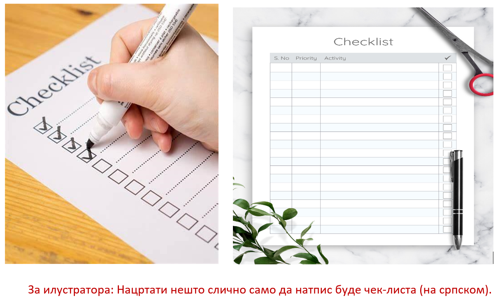

Израда личног плана коришћења дигиталних уређаја
================================================

Сигурно знаш да је редован сан веома важан. Храна, вода и физичка активност такође помажу нашем организму да нормално 
функционише и да самим тим имаш довољно снаге и енергије. Истовремено, уколико поједеш много више него што си заправио 
био гладан или не спаваш довољно, твоје тело реагује другачије.  свему треба имати меру. Исто је и са временом проведеним 
за рачунаром. 

.. infonote::

 Деца твог узраста за рачунаром не треба да проводе више од сат времена дневно!
 

   
Сигурно имаш негде истакнут распоред часова. Он ти помаже да у сваком тренутку поуздано знаш које часове у школи имаш тај 
дан и којим редоследом. 

У животу је организација веома важна пожељно је да увек имаш направљен неки план, на дневном нивоу, недељном, итд. 
Помоћу њега ћеш увек знати које су ти обавезе, када и колико ће трајати. 

Циљ ове лекције је да самостално или уз помоћ родитеља или наставника направиш свој план колико ћеш користити дигиталне 
уређаје у току једне недеље. Наравно, мораш дати све од себе да тај план реализујеш. Чак иако мало претераш, буди искрен 
и покушај следећи пут поново. 

.. infonote::

 Деца твог узраста за рачунаром не треба да проводе без паузе више од пола сата, а укупно сат времена дневно!

Ако се запиташ због чега је то важно, само се присети нежељених дејстава које превелико коришћење дигиталних уређаја може имати. На пример:

- Уколико превише времена гледаш у екран, могу те болети очи и глава а, на крају крајева, чак можеш и да оштетиш свој вид.
- Превише седења за рачунаром сигурно неће пријати твојим леђима, твоје тело се још развија и треба му што више физичке активности.
- можеш имати проблема са концентрацијом ако играш игрице и претражујеш интернет више него што би требало.
- Уколико већ због неког школског пројекта или обавеза мораш мало више времена да проведеш поред рачунара прави паузе, не приближавај очи превише монитору, звук нека буде умерене јачине, а положај тела исправан.
- последње, али не и најмање важно, играње са другарима у парку, на тренингу и време проведено у природи и на чистом ваздуху ништа не може заменити.

Погледај видео-запис који се налази испод, ту можеш поновити оно о чему смо сада говорили, а и научити нешто ново!

`Утицај дигиталних уређаја на наше здравље <https://www.youtube.com/watch?v=hUtev6nLWos>`_

Задатак 1
---------

Пажљиво погледај табелу дневних активности коју је направио дечак Миша и сазнаћеш како изгледа један његов дан.

   
.. questionnote::

 - Да ли мислиш да је добро организовао своје време?
 - Шта мислиш да би требало изменити и због чега?
 - Колико се твоје активности разликују од његових и по чему?

Да ли ти се некада догодило да кренеш у школу, али нешто заборавиш, или да отпутујеш и схватиш да уз себе немаш омиљену 
књигу, слушалице, нови качкет, и слично.

Како би то спречио можеш да направиш чек-листу (енг. *checklist*). Најпростије речено, чек-листе представљају 
списак ствари које су ти за нешто потребне или списак обавеза које мораш да урадиш да би нешто успешно завршио. 
Оне ће ти сигурно помоћи и олакшати организацију, а праве се брзо и лако. 

  
Помоћу следећих линкова можеш приступити интернет страницама на којима можеш бесплатно преузети или чак самостално или уз 
помоћ неког одраслог направити своју чек-листу:

https://www.canva.com/checklists/templates/

https://www.adobe.com/express/create/checklist

.. learnmorenote::

 У Ворду можеш направити своју чек-листу. За унос задатка у листу можеш користити доње црте (___). Није уопште тешко, 
 а себи на креативан начин можеш пуно да олакшаш!
 
Задатак 2
---------

Помоћу горепоменутих страница преузми или састави једну чек-листу, према јасним упутствима на страници, коју можеш 
користити за ствари које пакујеш за тренинг, одлазак на излет или за било шта за шта ће ти бити од користи. Не заборави да 
иако странице нуде огроман број шаблона да ће ти можда занимљивије бити да направиш свој. Истовремено, не заборави да кад год 
си у могућности олакшаш себи неки посао!

                         
Задатак 3 
---------

Направи своју табелу недељних активности. У њу унеси све оне активности које мислиш да су важне и занимљиве 
(одлазак у школу, позориште, биоскоп, учење, тренинг, играње, време проведено користећи рачунар или телефон...)

Не заборави да водиш рачуна да не претерујеш у коришћењу дигиталних уређаја!

Када завршиш, упореди своју табелу са другом или другарицом и разговарајте о квалитетним и занимљивим начинима да се 
проведе време.

Провери своје знање
-------------------

**Питање 1:**

Прекомерно коришћење дигиталних уређаја може бити штетно по здравље?

**а) Да**

б) Не

в) Зависи од тога колико година имаш

|

**Питање 2:**

Наведи штетне утицаје које прекомерно коришћење дигиталних уређаја може имати по здравље. Означи све тачне одговоре и сваки одговор образложи.

**а) Бол у кичми**

**б) Слабија концентрација**

**в) Несаница**

**г) Проблем са очима и главобоља**

д) Слабљење чула мириса и укуса

**ђ) Добијање слабијих оцена у школи**

|

**Питање 3:**

Да ли исти негативни утицај по здравље може имати коришћење интернета помоћу рачунара у односу на телефон, ако знаш да телефон има мањи екран и да је лакши?

**а) Да** 

б) Не

|

**Питање 4:**

Како би посаветова/ла дечака Мишу из задатка бр.1 који је поново једва стигао на први час и био поспан током читавог дана? Означи све тачне одговоре

**а) Да следећи пут легне на време.**

б) Да на тренинг одлази само преко викендом и преко распуста.

**г) Да мање времена проводи поред рачунара због штетних дејстава које оно може да има.**

д) Да воћна салата за ужину дан пред контролни никако није добар избор.

