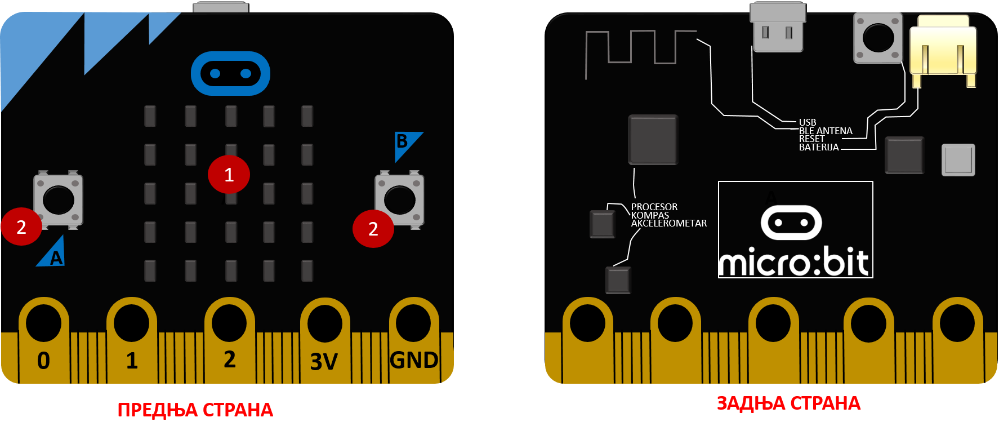
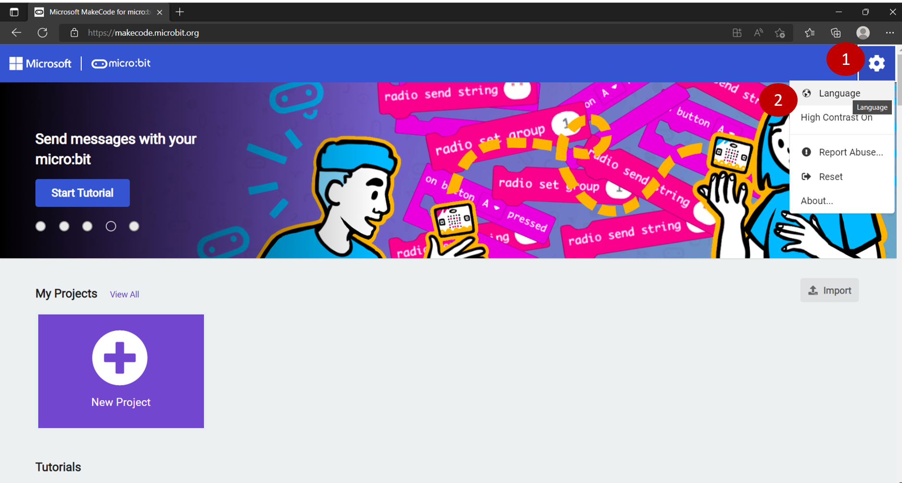
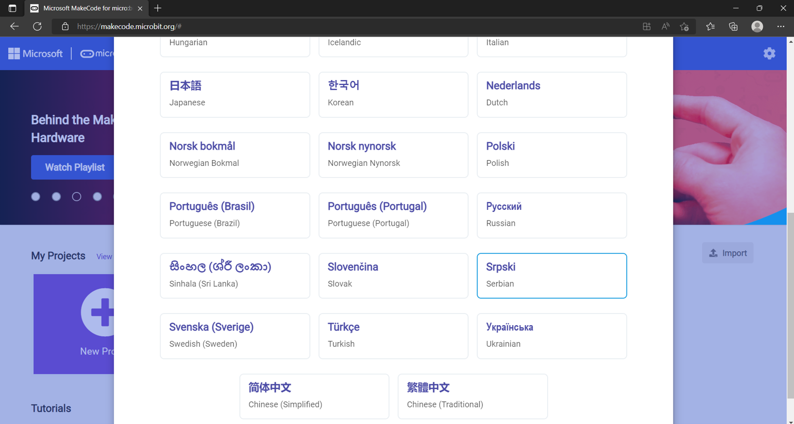
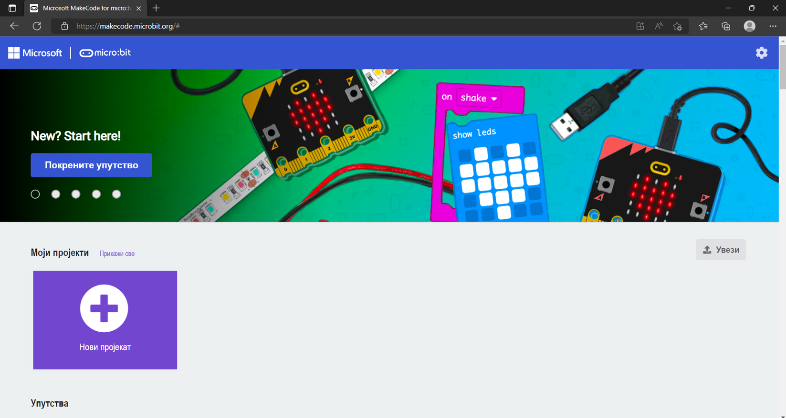
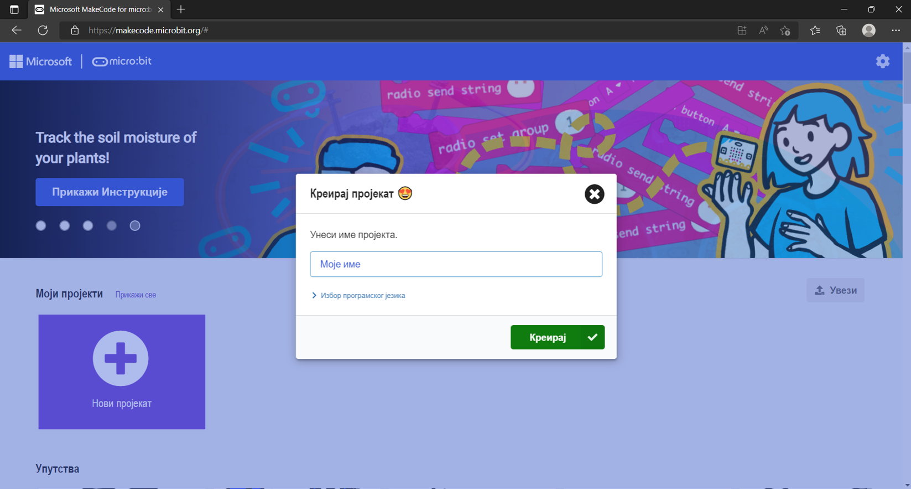
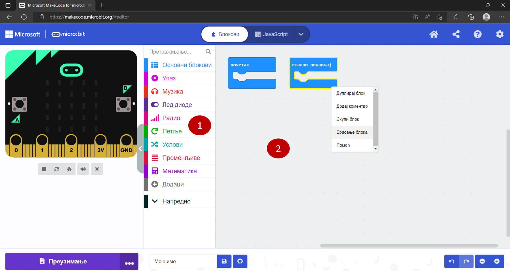
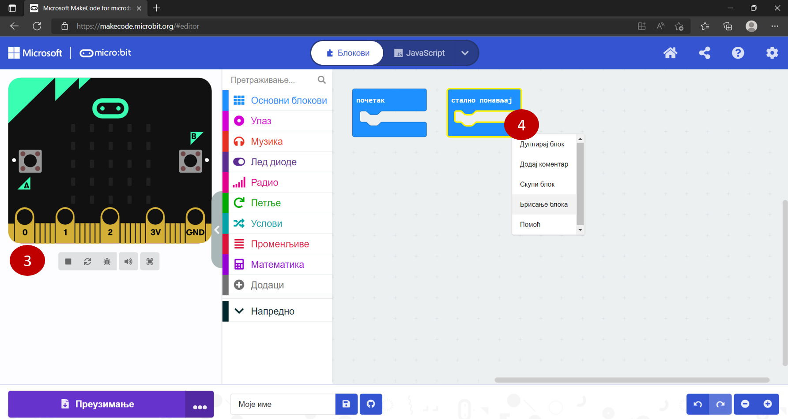
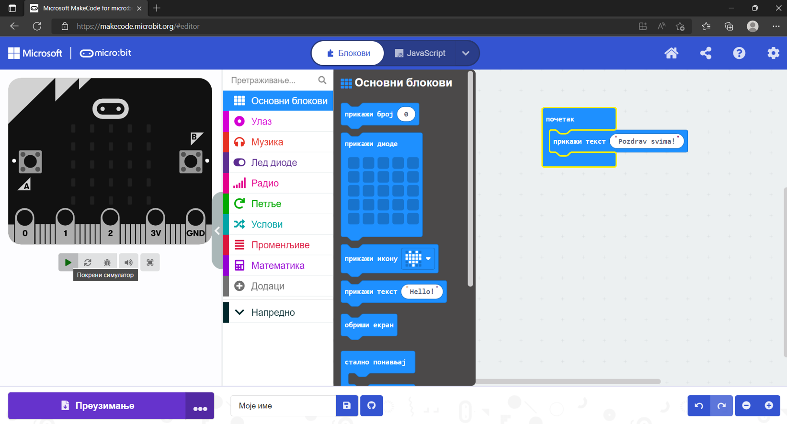
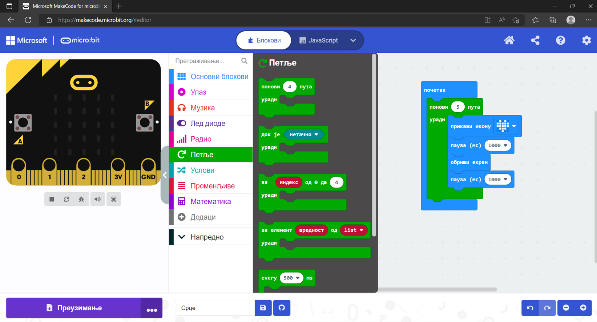
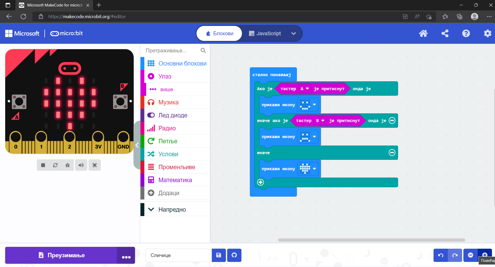

Програмирање физичких уређаја
=============================

Објаснили смо шта je дигитализација и где се све срећеш са вештачком интелигенцијом. 
Поменули смо да се у различите уређаје данас убацују сензори који могу да опазе шта се у њиховој 
околини дешава. Подаци са сензора се обрађују у уређају и он, на основу програма који је у њега 
учитан, зна како треба даље да се понаша (на пример, ако дуго не помераш свој телефон, смањиће 
се јачина светла на екрану како би се уштедела потрошња батерије).

Начин на који се програмирају овакви уређаји врло је сличан програмирању Карела. Наравно, за њихово 
програмирање углавном се користе прави, сложени програмски језици, али је логика иста. 
И за њихово програмирање важно је да се води рачуна о сваком кораку и редоследу извршавања, користе се 
петље, гранање, аритметичке и друге операције. Када једном схватиш како да на прави начин приступиш проблему, много ћеш лакше доћи до решења, без обзира на окружење или језик који користиш.

Један од уређаја који је развијен баш да би помогао деци да направе своје прве програмерске кораке јесте **микробит** (слика испод). 

|



|

На микробиту се налази мали екран на коме могу да се прикажу различите сличице и текст (1). Са леве и десне стране су два 
тастера (2). Можеш да одредиш шта треба да се деси када притиснеш неки од њих или оба истовремено. 
Микробит има сензоре за температуру, покрет, осветљеност…

Можеш да га програмираш слагањем блокова, али и у неком од правих програмских језика, попут Пајтона. 
У старијим разредима ћеш радити сложеније ствари. За сада је довољно да знаш да микробит има мали 
екран (са 25 лампица) и два тастера са предње стране.

|

Укуцај у прегледач адресу `makecode.microbit.org <https://makecode.microbit.org>`_. Отвориће се окружење у коме можеш да програмираш 
микробит. Пре него што покренеш нови пројекат (3), подеси језик окружења, како би ти рад био лакши и 
разумљивији.

Кликни на мали бели зупчаник у горњем десном углу (1). Кликни на *Language* да изабереш језик (2). 



|

Пронађи и изабери *Srpski*.



|

Сада је, вероватно, све јасније и можеш да почнеш да састављаш свој први пројекат. 
Кликни на правоугаоник са великим знаком плус и натписом **Нови пројекат**.



|

Унеси име које желиш да даш свом пројекту (на пример, *Моје име*) и кликни на дугме *Креирај*.



|



|

Окружење је врло слично Карелу. Блокови су смештени у различите групе (1). 
Сви блокови једне групе имају исту боју. Када кликнеш на назив групе, појавиће се блокови који се у 
њој налазе. И у овом окружењу програм састављаш тако што превлачиш мишем блокове које желиш 
у простор који се налази са десне стране (2).

Када покренеш пројекат, видећеш да су већ постављена два блока: ``почетак`` и ``стално понављај``. 
Користићеш их у зависности од оног што желиш да урадиш. Све што ставиш унутар блока ``почетак`` 
биће урађено само једном. Блок ``стално понављај`` омогућава да се све наредбе које се у њему налазе 
понављају све док је микробит укључен.

Микробит ћеш програмирати у старијим разредима. Сада желимо само да ти покажемо колико је програмирање 
оваквих, правих уређаја слично програмирању са овог курса.

Све школе имају микробит уређаје, али и ако не можеш да их програмираш у школи – није проблем. 


   
На левој страни окружења налази се слика микробита (3). То је **симулатор**. Он омогућава да видиш 
како би се понашао прави уређај када би у њега учитао састављен програм.

Ако направиш грешку или из било ког разлога желиш да избришеш неки блок, кликни на њега десним 
тастером миша и добићеш опције за које већ по натпису можеш да закључиш шта значе (4). Изабери *Брисање блока*.
За први пример неће нам бити потребан блок ``стално понављај``. Избриши га.

|

Пример 1
````````

**Састави програм за микробит који ће омогућити да се на екрану микробита испише твоје име.**

Када кликнеш на групу ``Основни блокови``, појавиће се блокови који омогућавају да прикажеш неки број, 
неку своју сличицу или знак, икону, текст, да по потреби обришеш оно што је тренутно приказано на екрану. 
Превуци блок прикажи текст у простор са десне стране и спусти га унутар блока почетак. 
Уместо натписа Hello! унеси своје име или неку поруку.



|

Испод слике микробита налази се пет сличица. Када приђеш мишем неком од њих, појавиће се текст који 
објашњава чему која служи. Редом: 

- покрени симулатор, 
- поново покрени симулатор, 
- укључи/искључи режим за отклањање грешака, 
- укључи/искључи звук (можеш да програмираш микробит и да свира!), 
- приказ преко целог екрана.

.. suggestionnote::

 **Текст који желиш да прикажеш на микробиту мора да буде написан латиничким писмом!**
 
Кликни на дугменце Покрени симулацију и посматрај шта се дешава. Колико је пута приказана твоја порука? 
(Решен пример: https://makecode.microbit.org/_06EA5WWvRemw)

.. questionnote::

 Шта би се десило када би, уместо блока почетак, био употребљен блок стално понављај? Провери!
 
Пример 2
````````

**Састави програм који ће омогућити да на екрану пет пута буде приказано срце (1 секунд приказано срце, па 1 секунд паузе, празан екран)**

У овом решењу примени бројачку петљу. Када кликнеш на групу ``Петље``, видећеш да се у њој налазе блокови слични онима које си већ користио у Карелу – 
за бројачку и условну петљу. Поређај блокове као на слици испод и покрени симулацију!




|

(Решен пример: https://makecode.microbit.org/_TtddcvETYXUk)

Комбинуј приказ сличица и текста који треба да се понављају неколико пута. 
Размисли како да примениш блок за условну петљу?

Пример 3
````````

**Добро проучи следећи програм. Објасни (без покретања симулатора) шта ће да ради микробит уређај у који га учитамо?**



|

(Решен пример: https://makecode.microbit.org/_d1pdwMHcg8v7)

.. learnmorenote::

 **Ако си заинтересован за програмирање микробит уређаја**
 
 Потребно је много више од једног часа да се упознаш са свим могућностима микробита. Програмираћеш га у старијим разредима, 
 прво слагањем блокова, а затим и у правом програмском језику. Ако те је заинтересовала ова тема и желиш 
 већ сада више да истражиш и научиш, слободно „завири“ у `Приручник за ученике петог разреда <https://petlja.org/biblioteka/r/kursevi/microbitbc>`_.
 